```{r}
#| include: false
library(knitr)
knitr::opts_chunk$set(echo = F,
                      warning = F,
                      error = F, 
                      message = F) 
```

```{r}
#| include: false

if (! require("pacman")) install.packages("pacman")

pacman::p_load(tidyverse, 
               here,
               kableExtra)

options(scipen=999)
rm(list = ls())
```


::: columns


::: {.column width="20%"}


{width='80%'}

{width='75%'}

{width='80%'}

:::

::: {.column .column-right width="80%"}


# Changes in preferences for market justice and conditional solidarity for public goods{style="font-size:21px; text-align:right; line-height:1.1;"}

### **The role of perceptions of meritocracy and privilege **{style="font-size:35px; text-align:right; line-height:1.1; margin-top:12px;"}

------------------------------------------------------------------------

</br>
**Juan Carlos Castillo**

::: {.blue2 .medium style="line-height:0.4; margin-top:0; margin-bottom:0;"}

**Department of Sociology, University of Chile** </br>

:::

</br>

Interdisciplinary International Dialogue Meeting on Representations of Economic Inequality and Their Consequences July 2026, Sciences Po Grenoble - Université Grenoble Alpes 


:::
:::


# Research project {background-color="#491106ff"}

## Project
::: {.columns}

::: {.column width="20%"}


:::

::: {.column width="80%"}
::: {.incremental .highlight-last style="font-size: 110%;"}
- ANID/FONDECYT N°1250518 **2025-2029** - Market Justice and Deservingness of Social Welfare

- Objective: *Analyze market justice preferences in Chile, their evolution over time, and their relation to welfare deservingness*

- Main argument: *Chile’s highly commodified welfare system strengthens meritocratic deservingness beliefs, thereby increasing preferences for market justice relative to less commodified contexts*

- Research design:
  * Comparative and longitudinal data analysis
  * Original survey
  * Survey experiments
  * Legislative debates on pensions
:::
:::
:::

:::{.notes}

- explain market justice: justification that access to social services should be determined by market-based criteria (e.g., income)

:::


## Team {background-color="#491106ff"}

::: {style="text-align: center;"}
{width='80%'}

Andreas Laffert, Tomás Urzúa, Juan Carlos Castillo, René Canales
:::

## Agenda {style="font-size: 75%;"}

### Peer reviewed Articles

::: {.incremental}

- Castillo, J. C., Iturra, J., Maldonado, L., Atria, J., & Meneses, F. (2023). A Multidimensional Approach for Measuring Meritocratic Beliefs: Advantages, Limitations and Alternatives to the ISSP Social Inequality Survey. International Journal of Sociology, 53(6), 448–472. [https://doi.org/10.1080/00207659.2023.2241875](https://doi.org/10.1080/00207659.2023.2241875)

- Castillo, J. C., Salgado, M., Carrasco, K., & Laffert, A. (2024). The Socialization of Meritocracy and Market Justice Preferences at School. *Societies*, 14(11), 214. [doi.org/10.3390/soc14110214](https://doi.org/10.3390/soc14110214)

- Castillo, J. C., Laffert, A., Carrasco, K., & Iturra-Sanhueza, J. (2025). Perceptions of inequality and meritocracy: their interplay in shaping preferences for market justice in Chile (2016–2023). Frontiers in Sociology, 10, 1634219. [https://doi.org/10.3389/fsoc.2025.1634219](https://doi.org/10.3389/fsoc.2025.1634219)

- Castillo, Juan Carlos; Iturra, Julio & Carrasco, Kevin (2025). Changes in the Justification of Educational Inequalities: The Role of Perceptions of Inequality and Meritocracy During the COVID Pandemic. Social Justice Research, 38(3) 240–263 https://doi.org/10.1007/s11211-025-00458-0

- Castillo, J. C., Canales Sellés, R., Laffert, A., & Urzúa, T. (2026). Justification trajectories for pension inequality in Chile (2016–2023): the role of social class and beliefs in meritocracy. *Frontiers in Sociology*, 11, 1771856. [https://doi.org/10.3389/fsoc.2026.1771856](https://doi.org/10.3389/fsoc.2026.1771856)

:::

### Forthcoming

::: {.incremental}
- Stability and comparability of meritocratic beliefs in school-age students: A measurement invariance approach across time and cohorts. Andreas Laffert, Juan Carlos Castillo, René Canales, Tomás Urzúa & Kevin Carrasco. *Submited*.

- Market justice and meritocracy: A structural equation modeling approach. Andreas Laffert, Tomás Urzúa, Juan Carlos Castillo & René Canales.

- Inequality and deservingness in higher education in Chile. A conjoint survey experiment. Juan Carlos Castillo, Andreas Laffert, René Canales & Tomás Urzúa. 


:::

# Background {background-color="#491106ff"}

## The Chilean case

::: {.incremental .highlight-last style="font-size: 110%;"}


- Chile combines high inequality with limited upward mobility and strong elite closure [@flores_top_2020; @lopez-roldan_comparative_2021; @torche_intergenerational_2014]

- Since the dictatorship (1973-1989), neoliberal reforms have deeply privatized and commodified key social services, while preserving strong state dependence [@madariaga_three_2020]

- Pensions: a **mandatory individual capitalization** system administered by **private pension funds** (AFP's) [@superintendencia_cuadros_2025]

- Health: a **dual system** of public and private insurance, with the public system (FONASA) covering 70% of the population [@superintendencia_cuadros_2025]

- Education: a triple **highly stratified system** of public, subsidized private, and private schools, with significant disparities in quality and access 

:::

## The problem

::: {.box-inv-4 .sp-after .fragment style="font-size: 110%;"}

1) Privatization and marketization of public goods, welfare policies, and social services [@gingrich_making_2011; @streeck_how_2016]

:::

::: {.box-inv-4 .sp-after .fragment style="font-size: 110%;"}

2) Changes in the institutional architecture of the welfare state; expansion of market logics [@ferre_welfare_2023; @busemeyer_welfare_2020]

:::

::: {.box-inv-4 .sp-after .fragment style="font-size: 110%;"}

3) This economic order is reflected in a specific moral economy and policy feedback dynamics [@mau_inequality_2015; @campbell_institutional_2020; @fernandez_positive_2013]

:::

::: {.box-inv-5 .sp-after-half .fragment style="font-size: 110%;"}

Market justice preferences [@busemeyer_skills_2015; @castillo_perceptions_2025; @koos_moral_2019; @lindh_public_2015]

:::


:::{.notes}
- over the last decades we observe a wave of privatization and marketization of public goods (that we can even trace back to the washington consensus)

- the introduction of market logics in public goods has led to changes in the institutional architecture of the welfare state, with a shift towards more market-based policies and a reduction of redistributive policies

- from a sociological point of view, this economic order is reflected in a specific moral economy and policy feedback dynamics, where market justice preferences play a key role in shaping public opinion and policy support

- this moral economic order is reflected in the emergence of market justice preferences, which are beliefs that access to social services should be determined by market-based criteria (e.g., income) 

:::

## Market justice preferences

::: {.incremental .highlight-last style="font-size: 120%;"}

- Lane [-@lane_market_1986]: market justice vs. political justice

- Normative beliefs that legitimize the idea that access to essential social services—such as healthcare, education, or pensions—should be determined by market-based criteria [@lindh_public_2015, p.895]

- Measurement: assessing whether individuals consider it fair that access to these services depends on income [@lindh_public_2015; @kluegel_legitimation_1999; @castillo_perceptions_2025]

:::

## Classical survey items for market justice (ISSP)

::: {style="text-align: center;"}
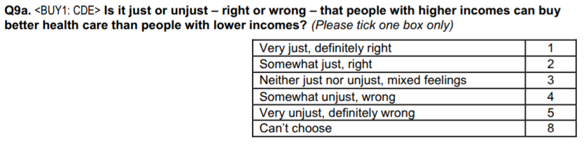
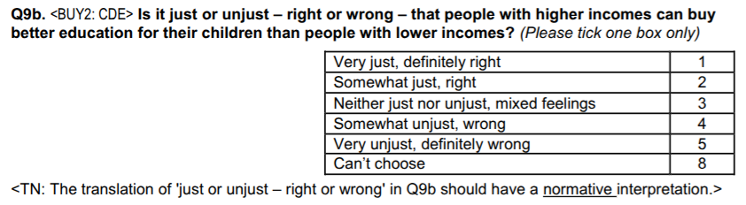
:::

## Factors associated with market justice

::::: columns
::: {.column width="50%" .incremental .highlight-last style="font-size: 110%;"}

### Individual

- Socioeconomic status—income, education, and occupation [@lindh_public_2015; @koos_moral_2019; @busemeyer_welfare_2020; @svallfors_political_2007]
- Perceptions of inequality and meritocracy [@castillo_perceptions_2025]
- Economic conservatism/liberalism [@lee_fairness_2024]
- **Desservingness** 

:::

::: {.column width="50%" .incremental .highlight-last style="font-size: 110%;"}
### Contextual

- Social spending [@immergut_it_2020; @busemeyer_skills_2015; @busemeyer_welfare_2020]
- Economic inequality [@koos_moral_2019]
- Degree of privatization and market regulation [@lindh_public_2015; @koos_moral_2019]

:::
:::::


# Meritocracy, deservingness, and market justice {background-color="#491106ff"}


## Including meritocracy

::: {.incremental .grey-highlight style="font-size: 120%;"}

- Merit = talent + effort [@young_rise_1958]

- Believing in meritocracy  has been associated with tolerance and acceptance of inequality [@sandel_tyranny_2020; @mijs_paradox_2019]

- We argue that meritocratic beliefs are a relevant driver of market justice preferences, as it provides a moral justification for the unequal distribution of resources and opportunities in society.

- but, **what are meritocratic beliefs?**

:::

<style>
.reveal .grey-highlight .fragment.current-fragment {
  background-color: #efefef;
  border-radius: 6px;
  padding: 0.15em 0.35em;
}

.reveal .grey-highlight .fragment.visible:not(.current-fragment) {
  opacity: 0.45;
}
</style>

## Multidimensional framework of meritocracy

::: {.fragment}

```{r}
#| fig-cap: "Castillo et al. (2023) conceptual model"
#| fig-align: center
#| out-width: '100%'
#| fig-cap-location: bottom
library(knitr)
library(here)

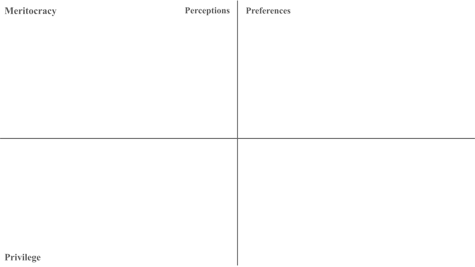

```

:::

::: {.notes}

To capture these different faces of meritocracy, we use a multidimensional framework that expands the usual way meritocracy is measured in empirical research.

:::

## Multidimensional framework of meritocracy

```{r}
#| fig-cap-location: bottom
#| fig-cap: "Castillo et al. (2023) conceptual model"
#| fig-align: center
#| out-width: '100%'


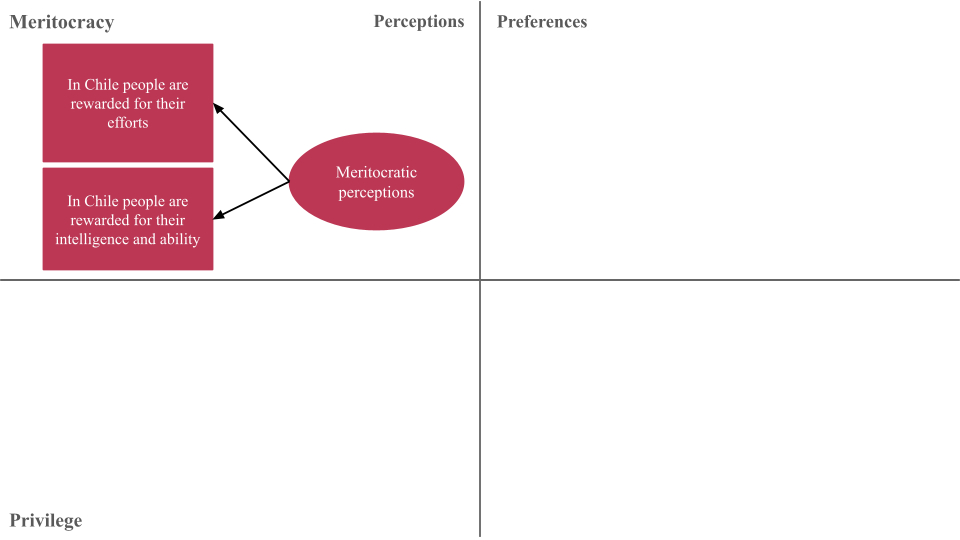

```


## Multidimensional framework of meritocracy


```{r}
#| fig-cap-location: bottom
#| fig-cap: "Castillo et al. (2023) conceptual model"
#| fig-align: center
#| out-width: '100%'


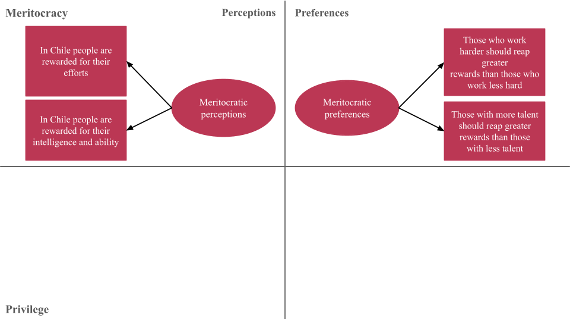
```

::: {.notes}

What this model adds is, first, a distinction between perceptions and preferences, where perceptions refer to how people think society works and preferences refer to how they think it should work. This is represented in the upper-right corner using the same items, but with a normative sense. 

:::

## Multidimensional framework of meritocracy


```{r}
#| fig-cap-location: bottom
#| fig-cap: "Castillo et al. (2023) conceptual model"
#| fig-align: center
#| out-width: '100%'


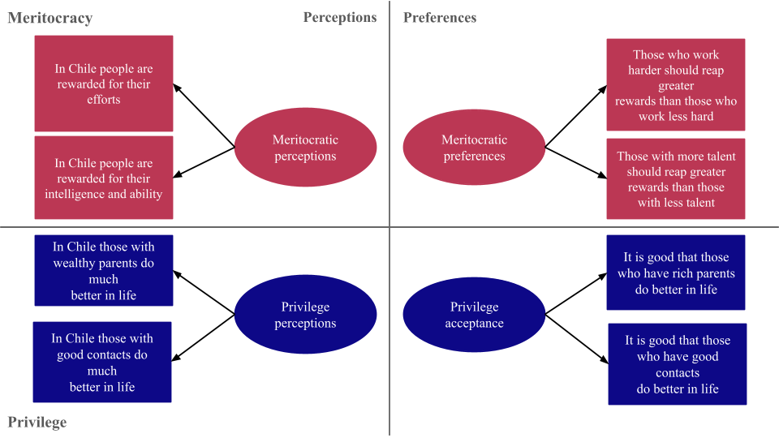
```


::: {.notes}

Second, it also incorporates non-meritocratic elements, captured through items on family wealth and social connections, both of which are shown at the bottom of the diagram. We call this dimension privilege.

:::

## Multidimensional framework of meritocracy


```{r}
#| fig-cap-location: bottom
#| fig-cap: "Castillo et al. (2023) conceptual model"
#| fig-align: center
#| out-width: '100%'


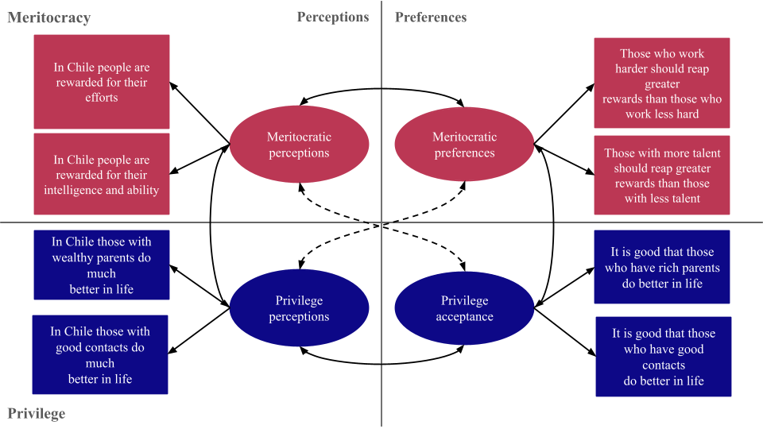
```

::: {.notes}
So, in total, the scale distinguishes four dimensions: perceived meritocracy, perceived privilege, preference for meritocracy, and acceptance of privilege. This means that recognizing privilege is not incompatible with supporting merit. Both can coexist within the same belief system.

Also, you can see the two items for each factor, all measured on a four-point agreement scale.

:::

## Incorporating deservingness criteria

::: {.incremental}

- Merit beliefs can be conceived as one of several criteria in terms of deservingness of social goods

- The deservingness literature [@oorschot_who_2000; @meuleman_welfare_2020; @knotz_recast_2022] had the advantage that

  - expands de criteria for public goods allocation

  - connected to welfare state literature

- A wider framework for understanding the relationship between meritocracy, redistribution, and inequality legitimation.

:::

## Deservingness frameworks

CARIN [@oorschot_who_2000; @meuleman_welfare_2020] + @knotz_recast_2022 frameworks: 

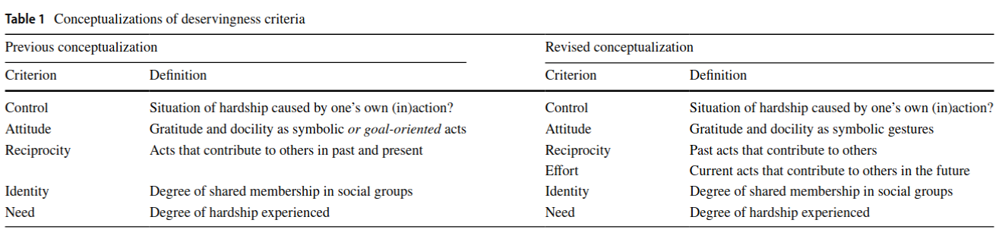

## An attempt of a whole picture

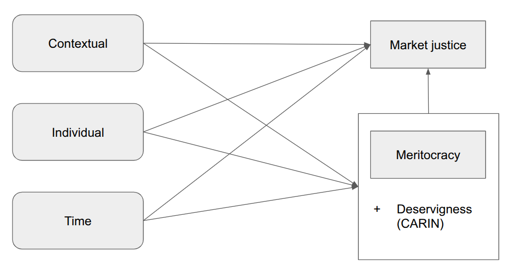


# Some studies {background-color="#491106ff"}

::: {style="font-size: 125%;"}
**A. Multidimensional meritocracy**

**B. Market justice preferences & meritocracy**

**C. Market justice preferences & deservingness (ongoing)**
:::


# Some studies {background-color="#491106ff"}

::: {style="font-size: 125%;"}
**[A. Multidimensional meritocracy]{style="background-color: #ffef72; color: #1f1f1f; padding: 0.1em 0.3em; border-radius: 4px;"}**

[**B. Market justice preferences & meritocracy**]{style="color: #9aa0a6; opacity: 0.65;"}

[**C. Market justice preferences & deservingness (ongoing)**]{style="color: #9aa0a6; opacity: 0.65;"}
:::


## Multidimensional framework of meritocracy ISSP

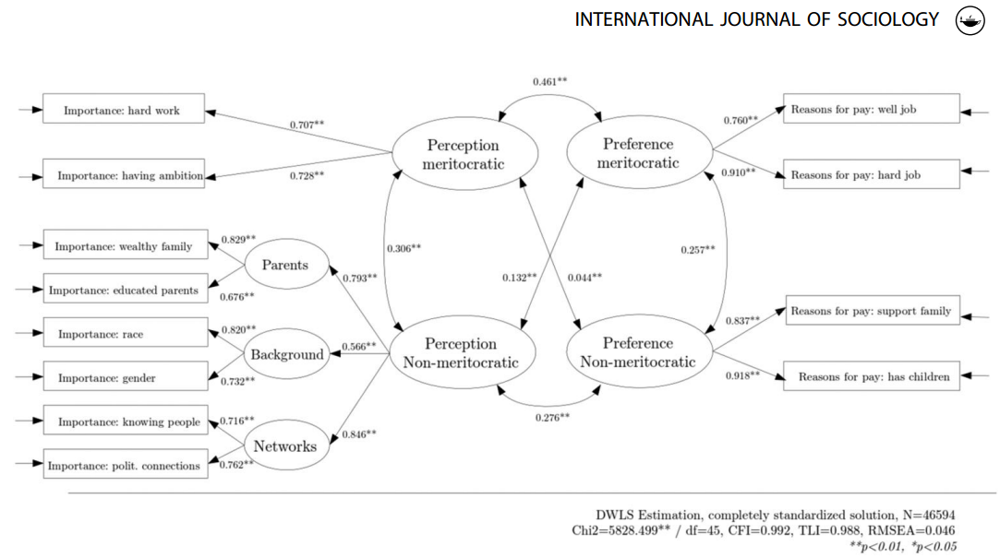

@castillo_multidimensional_2023

## Country level associations


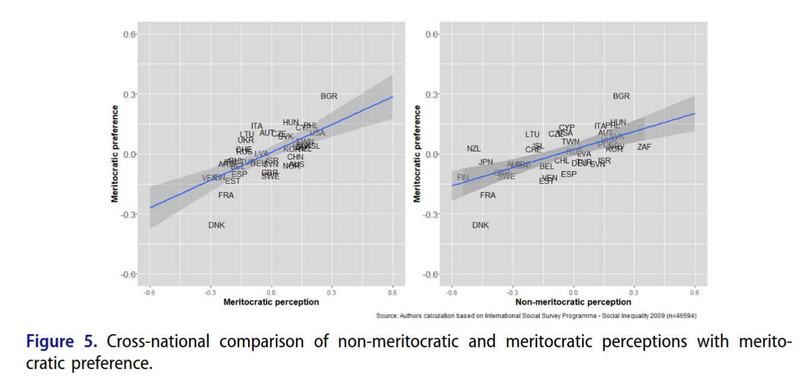

@castillo_multidimensional_2023


## Multidimensional meritocracy scale

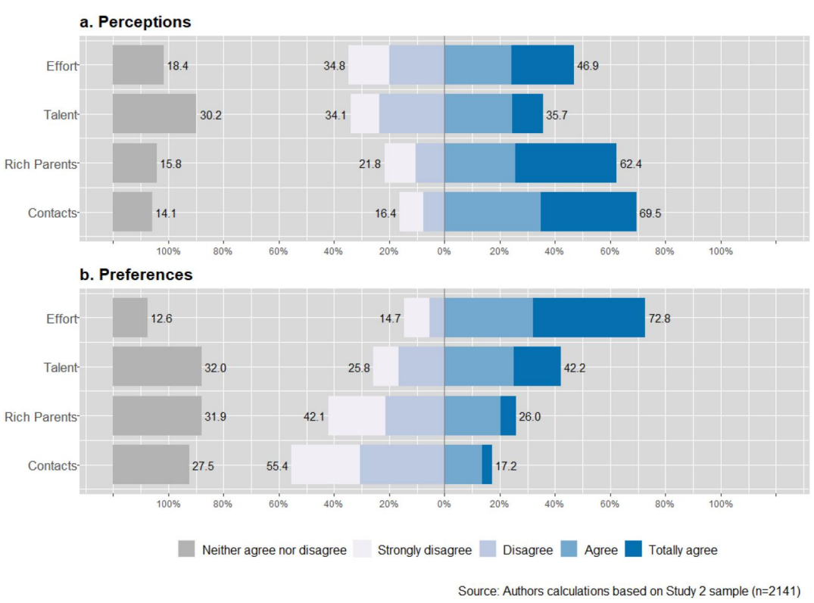{width=90% .lightbox}

@castillo_multidimensional_2023

## Merit Scale Chile CFA - adults

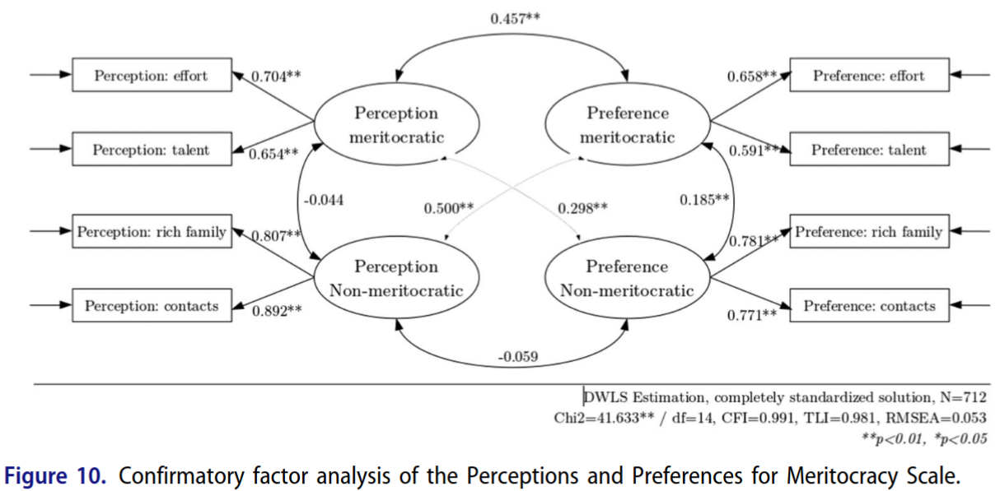

@castillo_multidimensional_2023

## Merit Scale Chile CFA - invariance students
@laffert_stability_2026
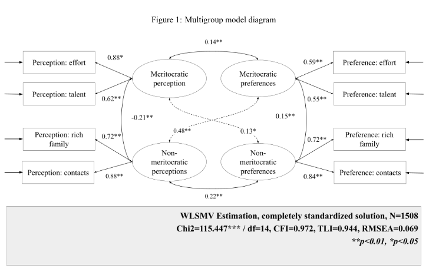{width="100%"}


# Some studies {background-color="#491106ff"}

::: {style="font-size: 125%;"}
[**A. Multidimensional meritocracy**]{style="color: #9aa0a6; opacity: 0.65;"}

**[B. Market justice preferences & meritocracy]{style="background-color: #ffef72; color: #1f1f1f; padding: 0.1em 0.3em; border-radius: 4px;"}**

[**C. Market justice preferences & deservingness (ongoing)**]{style="color: #9aa0a6; opacity: 0.65;"}
:::

## Market justice over time

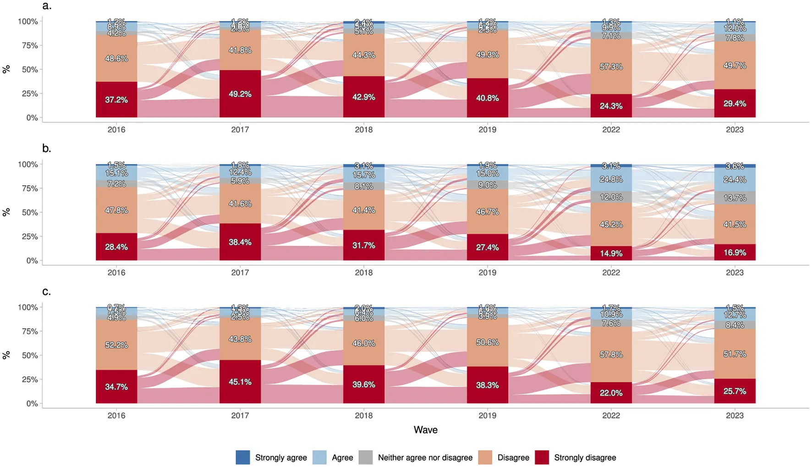

Change in the justification of inequality in healthcare, pensions and education over time (2016–2023). (a) Healthcare. (b) Pensions. (c) Education. Source: own elaboration with pooled data from ELSOC 2016–2023 (N obs = 8643; N groups = 1687).

@castillo_perceptions_2025


## Market justice education

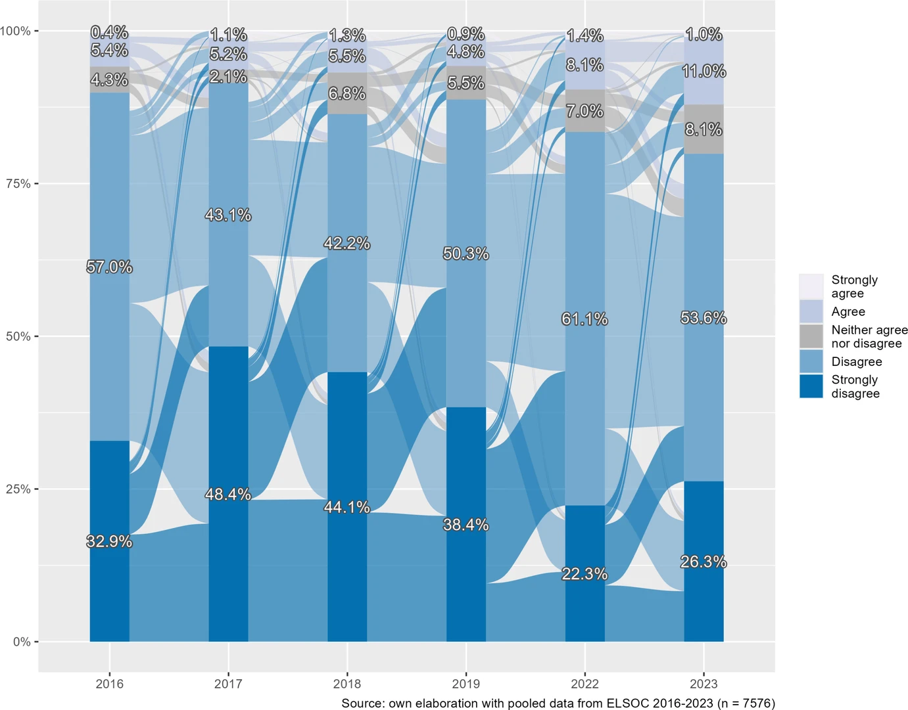

@castillo_changes_2025

## Market justice pensions

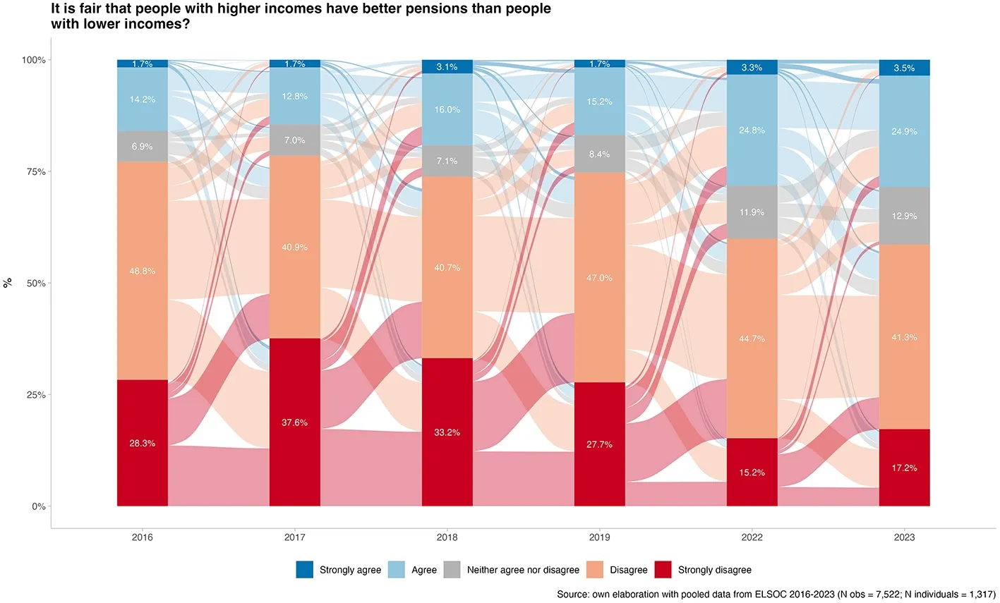

## Market justice pensions & social class

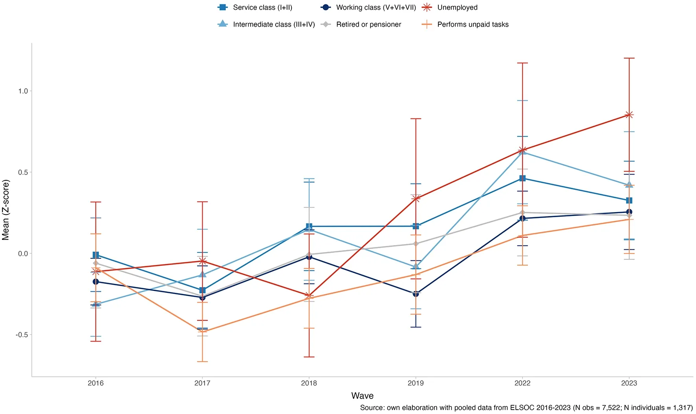

@castillo_justification_2026

## Market justice at school

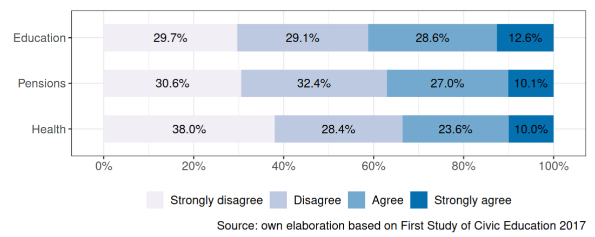

@castillo_socialization_2024


## Changes in market justice preferences over time


@castillo_perceptions_2025

## Market justice and multidimensional meritocracy

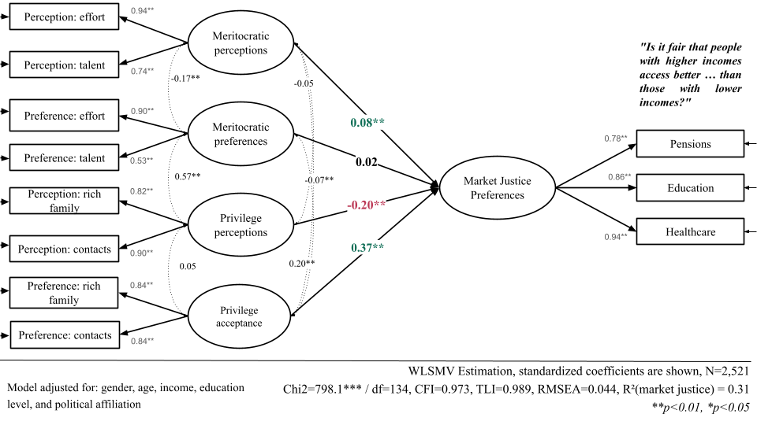

Laffert et al (2026)

# Some studies {background-color="#491106ff"}

::: {style="font-size: 125%;"}
[**A. Multidimensional meritocracy**]{style="color: #9aa0a6; opacity: 0.65;"}

[**B. Market justice preferences & meritocracy**]{style="color: #9aa0a6; opacity: 0.65;"}

**[C. Market justice preferences & deservingness (ongoing)]{style="background-color: #ffef72; color: #1f1f1f; padding: 0.1em 0.3em; border-radius: 4px;"}**
:::

## Main idea

- Estimate the relative weight of different deservingness criteria for allocating public goods in Chile

- Study the association between meritocratic beliefs and deservingness criteria

- Current study: conjoint-allocation survey experiment (inspired by @gilgen_principles_2025)

- Stage: pre-pilot (this week)
 
## Pilot survey

```{=html}
<iframe src="images/survey.html" width="100%" height="800" frameborder="0" style="border: none; background: #ffffff; opacity: 1; filter: none; mix-blend-mode: normal;"></iframe>
```

-> link to pre-pilot survey (allows translation in chrome): [https://jus-mer-pre-piloto-v1.hf.space/](https://jus-mer-pre-piloto-v1.hf.space/)

## Attributes and levels


<table style="width:100%; border-collapse:collapse; font-size:0.85rem; line-height:1.5;">
  <thead>
    <tr style="border-top:2px solid #000; border-bottom:1px solid #000; background:#f5f5f5;">
      <th style="padding:0.5rem 0.6rem; text-align:left; width:12%;">Attribute</th>
      <th style="padding:0.5rem 0.6rem; text-align:left; width:14%;">Criterion</th>
      <th style="padding:0.5rem 0.6rem; text-align:left; width:20%;">Profile label</th>
      <th style="padding:0.5rem 0.6rem; text-align:left; width:34%;">Levels</th>
      <th style="padding:0.5rem 0.6rem; text-align:left; width:20%;">Reference category</th>
    </tr>
  </thead>
  <tbody>
    <tr style="border-bottom:1px solid #ddd;">
      <td style="padding:0.5rem 0.6rem; vertical-align:top;"><strong>Need</strong></td>
      <td style="padding:0.5rem 0.6rem; vertical-align:top;">Need (CARIN/NICER)</td>
      <td style="padding:0.5rem 0.6rem; vertical-align:top;">Makes ends meet with <em>(Su hogar llega a fin de mes con:)</em></td>
      <td style="padding:0.5rem 0.6rem; vertical-align:top;">Hardship <em>(Dificultad)</em><br>Comfort <em>(Holgura)</em></td>
      <td style="padding:0.5rem 0.6rem; vertical-align:top;">Comfort <em>(Holgura)</em></td>
    </tr>
    <tr style="border-bottom:1px solid #ddd; background:#fafafa;">
      <td style="padding:0.5rem 0.6rem; vertical-align:top;"><strong>Effort</strong></td>
      <td style="padding:0.5rem 0.6rem; vertical-align:top;">Effort (NICER)</td>
      <td style="padding:0.5rem 0.6rem; vertical-align:top;">Studies <em>(Estudia:)</em></td>
      <td style="padding:0.5rem 0.6rem; vertical-align:top;">More than their peers <em>(Más que sus compañeros)</em><br>The same as their peers <em>(Igual que sus compañeros)</em><br>Less than their peers <em>(Menos que sus compañeros)</em></td>
      <td style="padding:0.5rem 0.6rem; vertical-align:top;">Less than their peers <em>(Menos que sus compañeros)</em></td>
    </tr>
    <tr style="border-bottom:1px solid #ddd;">
      <td style="padding:0.5rem 0.6rem; vertical-align:top;"><strong>Control</strong></td>
      <td style="padding:0.5rem 0.6rem; vertical-align:top;">Control (CARIN/NICER)</td>
      <td style="padding:0.5rem 0.6rem; vertical-align:top;">Needs the scholarship because <em>(Requiere la beca porque:)</em></td>
      <td style="padding:0.5rem 0.6rem; vertical-align:top;">Applied to other scholarships but received no funding <em>(Postuló a otras becas pero no obtuvo financiamiento)</em><br>Did not apply to other scholarships in time <em>(No alcanzó a postular a tiempo a otras becas)</em></td>
      <td style="padding:0.5rem 0.6rem; vertical-align:top;">Did not apply in time <em>(No alcanzó a postular a tiempo)</em></td>
    </tr>
    <tr style="border-bottom:1px solid #ddd; background:#fafafa;">
      <td style="padding:0.5rem 0.6rem; vertical-align:top;"><strong>Reciprocity</strong></td>
      <td style="padding:0.5rem 0.6rem; vertical-align:top;">Reciprocity (CARIN/NICER)</td>
      <td style="padding:0.5rem 0.6rem; vertical-align:top;">Outside their studies <em>(Fuera de sus estudios:)</em></td>
      <td style="padding:0.5rem 0.6rem; vertical-align:top;">Has done volunteer work <em>(Ha hecho voluntariado)</em><br>Has not done volunteer work <em>(No ha hecho voluntariado)</em></td>
      <td style="padding:0.5rem 0.6rem; vertical-align:top;">Has not done volunteer work <em>(No ha hecho voluntariado)</em></td>
    </tr>
    <tr style="border-bottom:1px solid #ddd;">
      <td style="padding:0.5rem 0.6rem; vertical-align:top;"><strong>Attitude</strong></td>
      <td style="padding:0.5rem 0.6rem; vertical-align:top;">Attitude (CARIN)</td>
      <td style="padding:0.5rem 0.6rem; vertical-align:top;">Sees the scholarship as <em>(Ve la beca como:)</em></td>
      <td style="padding:0.5rem 0.6rem; vertical-align:top;">Help they are grateful for <em>(Una ayuda que agradece)</em><br>Something they deserve <em>(Algo que se merece)</em></td>
      <td style="padding:0.5rem 0.6rem; vertical-align:top;">Something they deserve <em>(Algo que se merece)</em></td>
    </tr>
    <tr style="border-bottom:1px solid #ddd; background:#fafafa;">
      <td style="padding:0.5rem 0.6rem; vertical-align:top;"><strong>Identity</strong></td>
      <td style="padding:0.5rem 0.6rem; vertical-align:top;">Identity (CARIN/NICER)</td>
      <td style="padding:0.5rem 0.6rem; vertical-align:top;">Country of birth <em>(País de nacimiento:)</em></td>
      <td style="padding:0.5rem 0.6rem; vertical-align:top;">Chile<br>Venezuela<br>Peru <em>(Perú)</em></td>
      <td style="padding:0.5rem 0.6rem; vertical-align:top;">Chile</td>
    </tr>
    <tr style="border-bottom:2px solid #000;">
      <td style="padding:0.5rem 0.6rem; vertical-align:top;"><strong>Sex</strong></td>
      <td style="padding:0.5rem 0.6rem; vertical-align:top;">Ascriptive (signaled by name)</td>
      <td style="padding:0.5rem 0.6rem; vertical-align:top;">First name (no explicit row)</td>
      <td style="padding:0.5rem 0.6rem; vertical-align:top;">Female name<br>Male name</td>
      <td style="padding:0.5rem 0.6rem; vertical-align:top;">Male</td>
    </tr>
  </tbody>
</table>
<p style="font-size:0.8rem; color:#555; margin-top:0.8rem;"><em>Note: Levels are given in English, with the ooriginal Spanish wording shown to respondents in parentheses. The factorial space comprises 2 (Need) × 3 (Effort) × 2 (Control) × 2 (Reciprocity) × 2 (Attitude) × 3 (Identity) × 2 (Sex) = 288 unique profiles. Attributes are assigned independently and uniformly at the profile level. Sex is signaled through gendered first names drawn from matched pools rather than as an explicit table row.</em></p>


## Next steps

::: {.fragment}
### Survey

::: {style="margin-left: 2em;"}
- conjoint-allocation experiment

- expand market justice measurement

- longitudinal design (2026-2028)
:::
:::

::: {.fragment}
### Latent class analysis of meritocracy 

::: {style="margin-left: 2em;"}
+ relationship with deservingness criteria
:::
:::

::: {.fragment}
### Market justice in international comparative perspective (ISSP 1999-2019)

::: {style="margin-left: 2em;"}
+ health
+ education
:::
:::


#

::: columns


::: {.column width="20%"}


{width='80%'}

{width='75%'}

{width='80%'}

:::

::: {.column .column-right width="80%"}


# Changes in preferences for market justice and conditional solidarity for public goods{style="font-size:21px; text-align:right; line-height:1.1;"}

### **The role of perceptions of meritocracy and privilege **{style="font-size:35px; text-align:right; line-height:1.1; margin-top:12px;"}

------------------------------------------------------------------------

</br>
**Juan Carlos Castillo**

::: {.blue2 .medium style="line-height:0.4; margin-top:0; margin-bottom:0;"}

**Department of Sociology, University of Chile** </br>

:::

</br>

Interdisciplinary International Dialogue Meeting on Representations of Economic Inequality and Their Consequences July 2026, Sciences Po Grenoble - Université Grenoble Alpes 


:::
:::


# References


