```{r}
#| include: false
library(knitr)
knitr::opts_chunk$set(echo = F,
                      warning = F,
                      error = F, 
                      message = F) 
```

```{r}
#| include: false

if (! require("pacman")) install.packages("pacman")

pacman::p_load(tidyverse, 
               here,
               kableExtra)

options(scipen=999)
rm(list = ls())
```


::: columns


::: {.column width="20%"}

<br>
<br>
<br>
<br>
<br>
<br>

{width='70%'}

{width='80%'}


:::

::: {.column .column-right width="80%"}


<br>

# Conceptualizing and measuring meritocracy {style="font-size:21px; text-align:right; line-height:1.1;"}

### **Background, developments and extensions** {style="font-size:35px; text-align:right; line-height:1.1; margin-top:12px;"}

------------------------------------------------------------------------

</br>
**Juan Carlos Castillo**

**Tomás Urzúa**

::: {.blue2 .medium style="line-height:0.4; margin-top:0; margin-bottom:0;"}

**Department of Sociology, University of Chile** </br>

:::

</br>

September 2026 - Online presentation for the EDUMERIT ERC Project, Tallin University.


:::
:::


# 1. Background {background-color="#491106ff"}

## Project grant 1 

<br>

::: {.columns}

::: {.column width="40%" style="vertical-align: middle;"}

{width='80%'}

:::

::: {.column width="60%" style="vertical-align: middle;"}

### The moral economy of inequality and redistributive preferences (2016-2020) - FONDECYT N°1160161

- Analyze the relationship between beliefs in meritocracy and redistributive preferences from a moral economy perspective, considering the institutional context in Chile and international comparative perspective.

:::
:::

## Project grant2

<br>

::: {.columns}

::: {.column width="40%" style="vertical-align: middle;"}

{width='80%'}

:::

::: {.column width="60%" style="vertical-align: middle;"}

### EDUMER: Meritocracy in Schools - Moral Foundations of the Educational Market and its Implications for Civic Education in Chile (2021-2024) - FONDECYT N°1210847

- Analyze the socialization of meritocratic beliefs in schools, their evolution over time, and their implications for civic education and social cohesion.

:::
:::


## Project grant 3 

<br>

::: {.columns}

::: {.column width="40%" style="vertical-align: middle;"}

{width='60%'}

:::

::: {.column width="60%" style="vertical-align: middle;"}

### JUSMER: Market Justice and Deservingness of Social Welfare (2025-2029) - FONDECYT N°1250518

- Objective: *Analyze market justice preferences in Chile, their evolution over time, and their relation to welfare deservingness*

:::
:::

:::{.notes}

- explain market justice: justification that access to social services should be determined by market-based criteria (e.g., income)

:::

## Selected articles {style="font-size: 75%;"}

### Peer reviewed

- Castillo, J. C., Iturra, J., Maldonado, L., Atria, J., & Meneses, F. (2023). A Multidimensional Approach for **Measuring Meritocratic Beliefs**: Advantages, Limitations and Alternatives to the ISSP Social Inequality Survey. *International Journal of Sociology*, 53(6), 448–472. [https://doi.org/10.1080/00207659.2023.2241875](https://doi.org/10.1080/00207659.2023.2241875)

- Castillo, J. C., Salgado, M., Carrasco, K., & Laffert, A. (2024). The Socialization of Meritocracy and Market Justice Preferences at **School**. *Societies*, 14(11), 214. [doi.org/10.3390/soc14110214](https://doi.org/10.3390/soc14110214)

- Castillo, J. C., Laffert, A., Carrasco, K., & Iturra-Sanhueza, J. (2025). Perceptions of inequality and meritocracy: their interplay in shaping preferences for **market justice in Chile** (2016–2023). *Frontiers in Sociology*, 10, 1634219. [https://doi.org/10.3389/fsoc.2025.1634219](https://doi.org/10.3389/fsoc.2025.1634219)

- Castillo, Juan Carlos; Iturra, Julio & Carrasco, Kevin (2025). Changes in the Justification of **Educational** Inequalities: The Role of Perceptions of Inequality and Meritocracy During the COVID Pandemic. Social Justice Research, 38(3) 240–263 https://doi.org/10.1007/s11211-025-00458-0

- Castillo, J. C., Canales Sellés, R., Laffert, A., & Urzúa, T. (2026). Justification trajectories for **pension** inequality in Chile (2016–2023): the role of social class and beliefs in meritocracy. *Frontiers in Sociology*, 11, 1771856. [https://doi.org/10.3389/fsoc.2026.1771856](https://doi.org/10.3389/fsoc.2026.1771856)

### Forthcoming

- Stability and comparability of meritocratic beliefs in school-age students: A **measurement invariance ** approach across time and cohorts. Andreas Laffert, Juan Carlos Castillo, René Canales, Tomás Urzúa & Kevin Carrasco. *Submited*.

- Market justice and meritocracy: A **structural equation modeling** approach. Andreas Laffert, Tomás Urzúa, Juan Carlos Castillo & René Canales.

- Inequality and deservingness in higher education in Chile. A **conjoint** survey experiment. Juan Carlos Castillo, Andreas Laffert, René Canales & Tomás Urzúa. 

- Objective and subjective status: their interplay with market justice preferences in a **comparative perspective**. Juan Carlos Castillo, Tomás Urzúa

- Market justice preferences in **education**: The role of meritocratic beliefs in the chilean context. Tomás Urzúa, Juan Carlos Castillo


# 2. Developments  {background-color="#491106ff"}

##

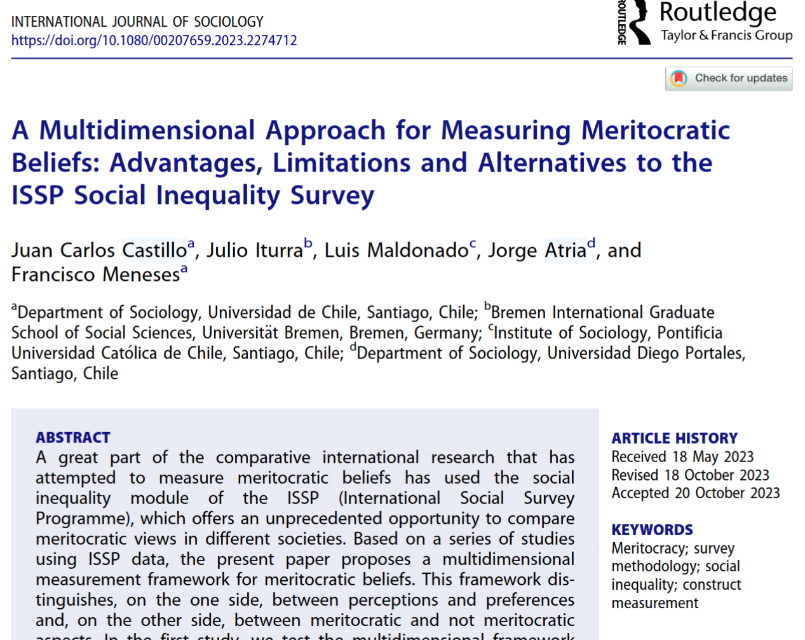

## Black box of meritocratic beliefs


- Merit: only effort? -> add talent

- Beliefs? -> perceptions and preferences

- Non-meritocratic elements? -> add privilege

- Measurement error -> latent variable modeling

## Multidimensional framework of meritocracy

::: {.fragment}

```{r}
#| fig-cap: "Castillo et al. (2023) conceptual model"
#| fig-align: center
#| out-width: '100%'
#| fig-cap-location: bottom
library(knitr)
library(here)

knitr::include_graphics("images/diagramas(4).png")

```

:::

::: {.notes}

To capture these different faces of meritocracy, we use a multidimensional framework that expands the usual way meritocracy is measured in empirical research.

:::

## Multidimensional framework of meritocracy

```{r}
#| fig-cap-location: bottom
#| fig-cap: "Castillo et al. (2023) conceptual model"
#| fig-align: center
#| out-width: '100%'


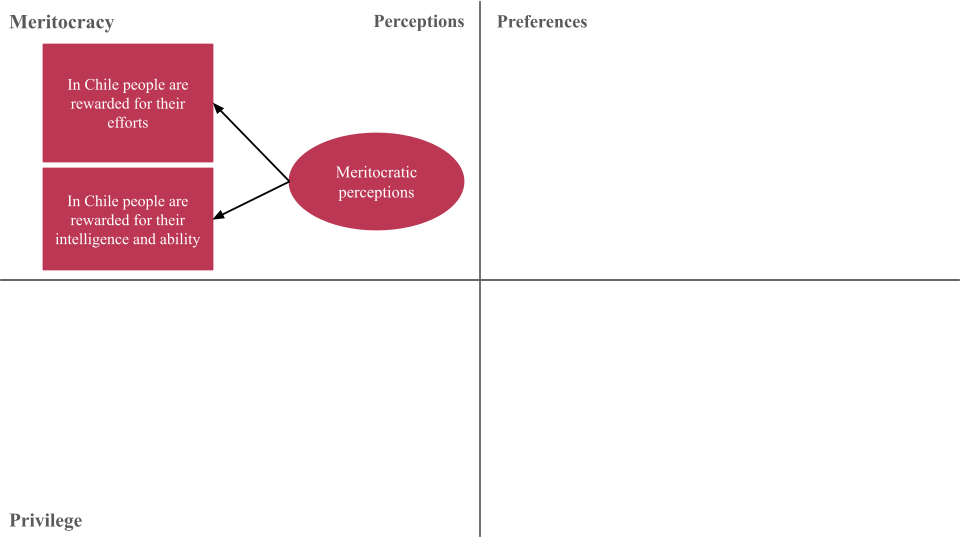

```


## Multidimensional framework of meritocracy


```{r}
#| fig-cap-location: bottom
#| fig-cap: "Castillo et al. (2023) conceptual model"
#| fig-align: center
#| out-width: '100%'


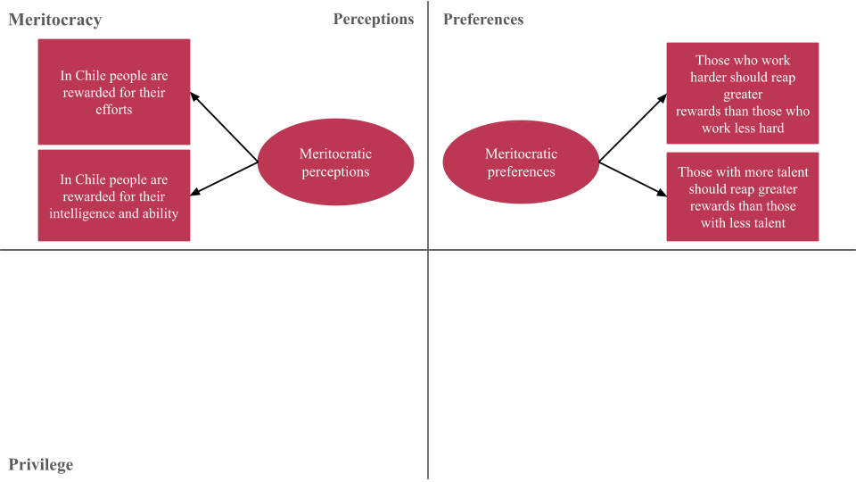
```

::: {.notes}

What this model adds is, first, a distinction between perceptions and preferences, where perceptions refer to how people think society works and preferences refer to how they think it should work. This is represented in the upper-right corner using the same items, but with a normative sense. 

:::

## Multidimensional framework of meritocracy


```{r}
#| fig-cap-location: bottom
#| fig-cap: "Castillo et al. (2023) conceptual model"
#| fig-align: center
#| out-width: '100%'


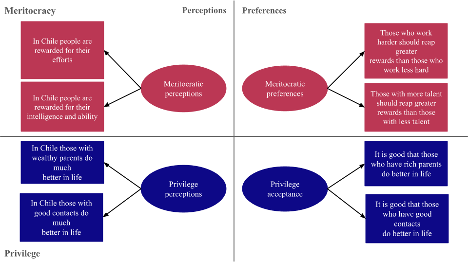
```


::: {.notes}

Second, it also incorporates non-meritocratic elements, captured through items on family wealth and social connections, both of which are shown at the bottom of the diagram. We call this dimension privilege.

:::

## Multidimensional framework of meritocracy


```{r}
#| fig-cap-location: bottom
#| fig-cap: "Castillo et al. (2023) conceptual model"
#| fig-align: center
#| out-width: '100%'


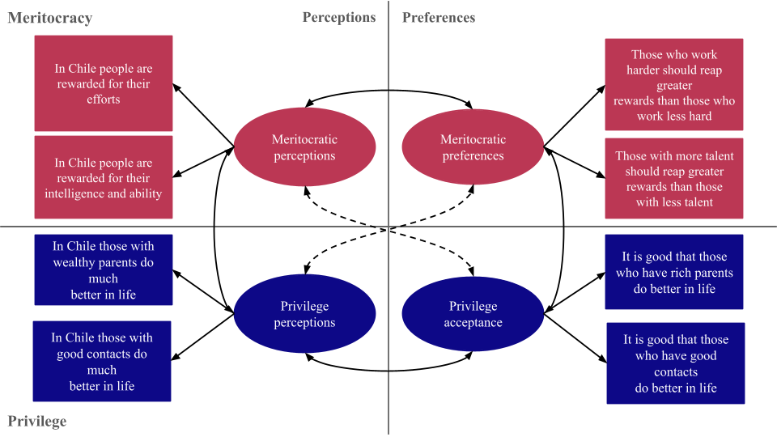
```

::: {.notes}
So, in total, the scale distinguishes four dimensions: perceived meritocracy, perceived privilege, preference for meritocracy, and acceptance of privilege. This means that recognizing privilege is not incompatible with supporting merit. Both can coexist within the same belief system.

Also, you can see the two items for each factor, all measured on a four-point agreement scale.

:::


## 

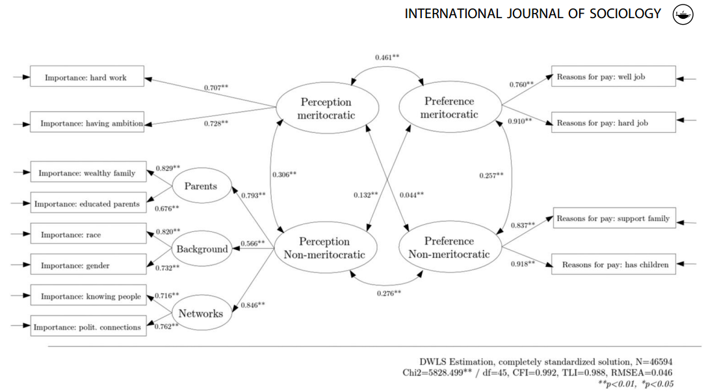

:::{style="font-size: 16px;"}
Castillo, J. C., Iturra, J., Maldonado, L., Atria, J., & Meneses, F. ([2023](https://doi.org/10.1080/00207659.2023.2274712)). A Multidimensional Approach for Measuring Meritocratic Beliefs: Advantages, Limitations and Alternatives to the ISSP Social Inequality Survey. *International Journal of Sociology, 53*(6), 448–472. [https://doi.org/10.1080/00207659.2023.2274712](https://doi.org/10.1080/00207659.2023.2274712)
:::


:::{.notes}
this was the first attempt to apply the multidimensional framework using ISSP 2009 data. We can see that the model's fit indices are acceptable, so we can conclude that meritocracy can be measured using a multidimensional approach.

items que se pueden asociar a los factores de meritocracia aunque no fueron hechos para esto

para percepción utilizamos la batería del get ahead

-> mencionar los items 

and for the case of preferences we use the items "reasons to pay" 

"how important is for getting paid"
:::

##

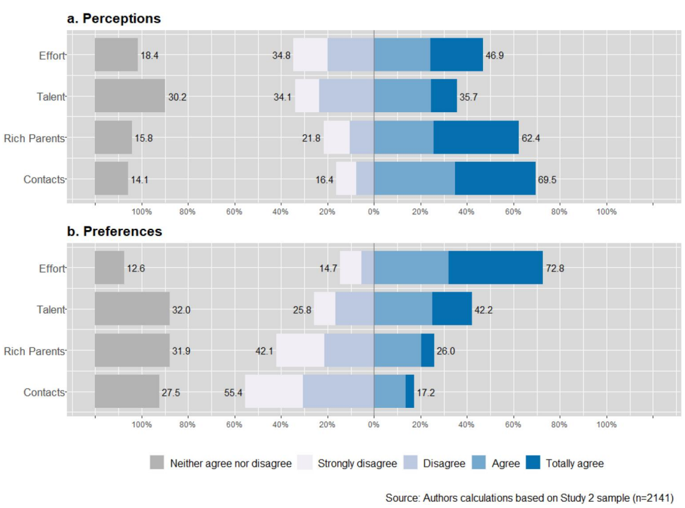{width=85% .lightbox}

:::{style="font-size: 18px;"}
Castillo, J. C., Iturra, J., Maldonado, L., Atria, J., & Meneses, F. ([2023](https://doi.org/10.1080/00207659.2023.2274712)). A Multidimensional Approach for Measuring Meritocratic Beliefs: Advantages, Limitations and Alternatives to the ISSP Social Inequality Survey. *International Journal of Sociology, 53*(6), 448–472. [https://doi.org/10.1080/00207659.2023.2274712](https://doi.org/10.1080/00207659.2023.2274712)
:::


:::{.notes}
 

In this slide, I show you two graphs: the f*e*rst one represents the items of the meritocratic scale with the items of effort and talent at the top, and the items related to privilege beliefs at the bottom.

The second graph instead shows the preferences of the meritocratic scale in the same order as the previous graph, meritocratic items at the top and privilege items at the bottom

These items were measured using a 5-point Likert scale, but to present the results more clearly, we excluded the “neutral” category to focus on the “agree” and “disagree” categories.

The lighter sections represent the "disagree" categories, and the bluer sections represent the "agree" categories.

Well, as the figure shows, people perceive that privilege takes precedence over effort and talent in the distribution of rewards in society.

But when we ask people **what** they prefer, the picture is reversed. 

The vast majority would like effort to be the guiding principle for success, while talent takes a back seat. 

In contrast, only a minority believes it is acceptable for family wealth or connections to influence society’s rewards

even though only a few people prefer that privilege operate in society, in the case of parental wealth it is a 25% of agree, that is, a quarter of people prefer that the economic capital of the family is a valid criterion for success,

And this can be dangerous in relation to the justification of inequalities, so it should not go unnoticed.

:::

## 

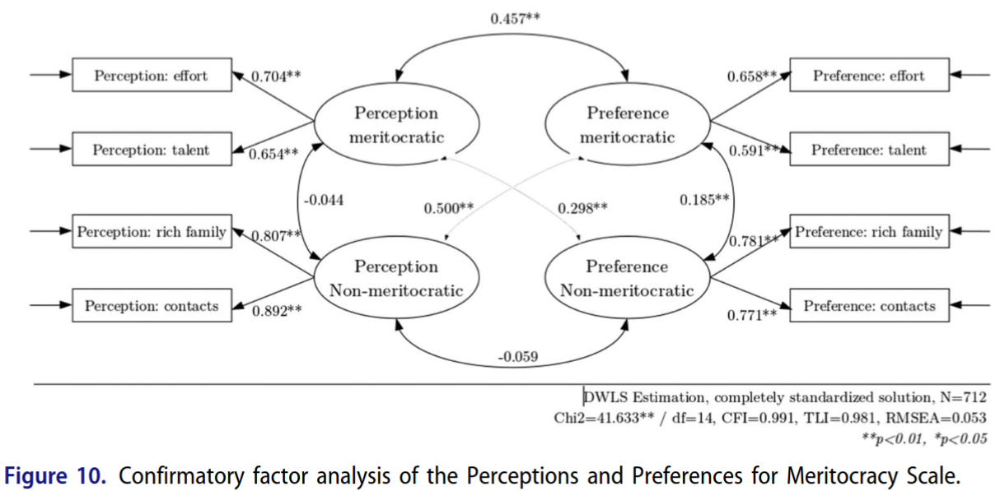

:::{style="font-size: 18px;"}
Castillo, J. C., Iturra, J., Maldonado, L., Atria, J., & Meneses, F. ([2023](https://doi.org/10.1080/00207659.2023.2274712)). A Multidimensional Approach for Measuring Meritocratic Beliefs: Advantages, Limitations and Alternatives to the ISSP Social Inequality Survey. *International Journal of Sociology, 53*(6), 448–472. [https://doi.org/10.1080/00207659.2023.2274712](https://doi.org/10.1080/00207659.2023.2274712)
:::

:::{.notes}

After that, we performed a confirmatory factor analysis to assess wether was possible to identifying the four factors of the model

And after the analyses we were able to observe two main results: f*é*rst, the model is able to distinguish between the four factors of the model

The second result is even more interesting: there are correlations between factors that, at first glance, might seem contradictory, like the positive association between meritocratic preferences and non-meritocratic preferences.

So, with this we find that factors that seems contradictory can actually coexist in people's minds

:::

## 

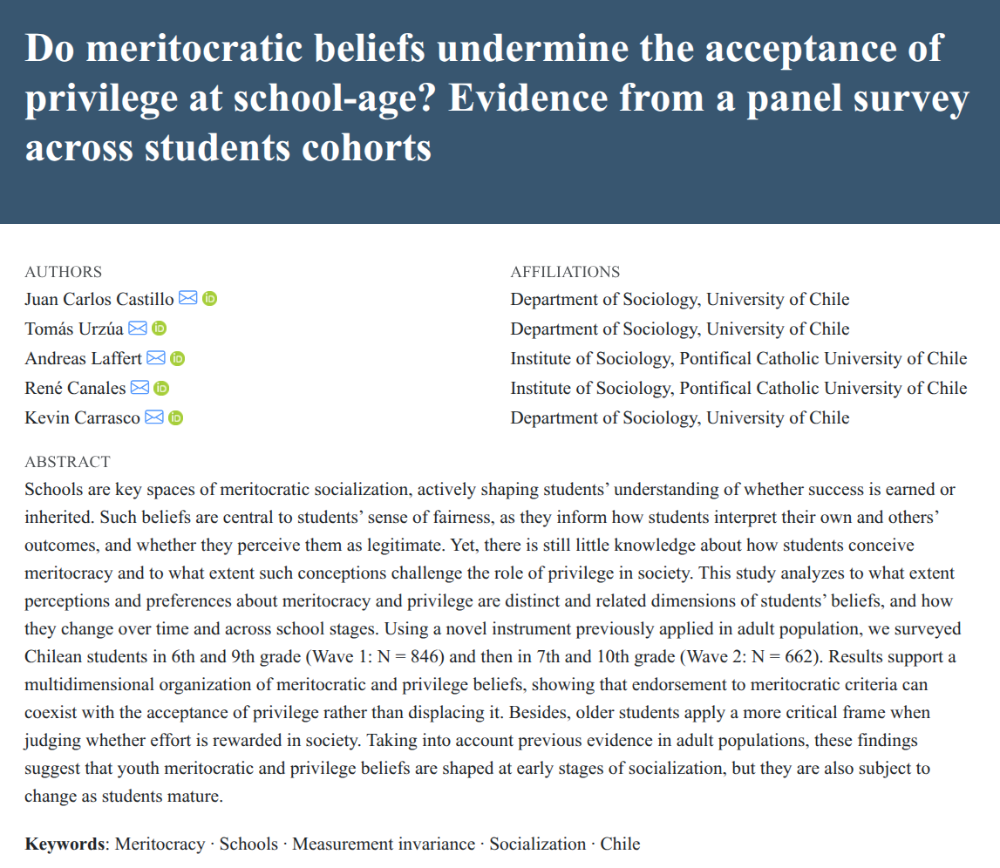{width="70%"}


## Participants and procedure

::: {.incremental .highlight-last style="font-size: 120%;"}

- [Education and Meritocracy Panel Survey (EDUMER)](https://github.com/educacion-meritocracia/edumer-data) in its 2023 and 2024 waves for students.

- CAWI survey application to elementary and high school students from 9 schools in the Metropolitan Region and Valparaíso, Chile.

- First wave (_N_ = 846) composed of 386 girls, 421 boys, 39 who identify as other; $M_{age}$ = 13.4, $SD_{age}$ = 1.6

- Second wave (_N_ = 662) composed of 303 girls, 338 boys, 21 who identify as other; $M_{age}$ = 14.4, $SD_{age}$ = 1.6

:::

## 

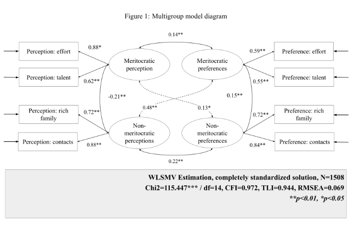{width="100%"}

##


## 

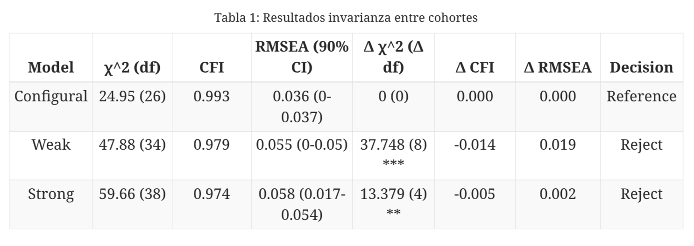


:::{.notes}
Related to the previous slide, we also apply the meritocracy scale to the student population to discover if it also worked at younger ages

And as a result, we observed that the scale also works at the student level.

Just to mention it, this is still a work in progress that is already in the final phase
:::


##

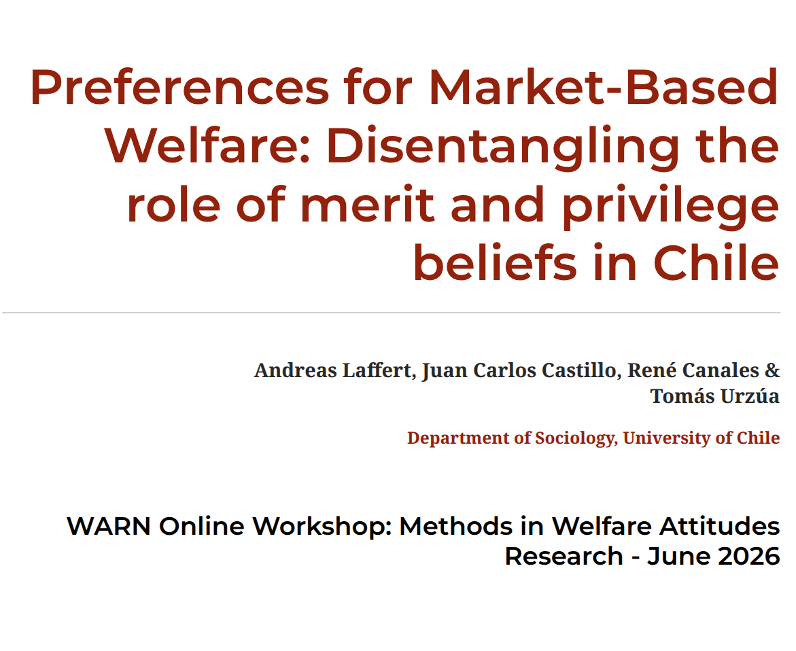{width="80%" fig-align="center"}

## Data

:::: {.incremental style="font-size: 120%;"}

- EDUMERCO: Online survey (CAWI), fielded in 2025, with adult respondents from the Metropolitan Region of Chile  

- Non-probability sample with quota-based design  
    → approximating population parameters by age, gender, education, and socioeconomic status  

- Total sample: N = 3,470  

:::: 

## CFA

```{r}
#| fig-cap-location: bottom
#| fig-cap: "Confirmatory Factor Analysis"
#| fig-align: center
#| out-width: '100%'


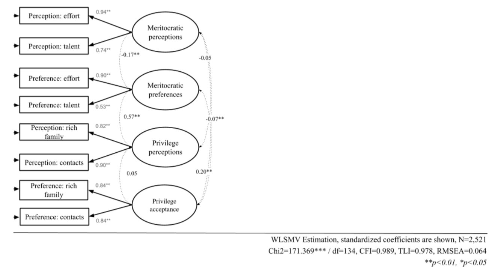
```

## SEM Model

```{r}
#| fig-cap-location: bottom
#| fig-cap: "Structural Ecuation Model"
#| fig-align: center
#| out-width: '100%'


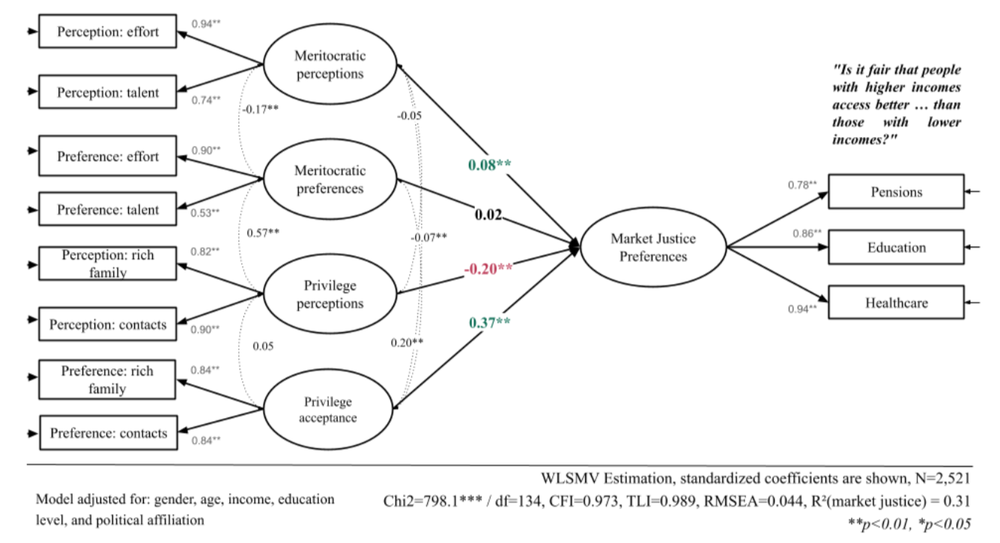
```


# 3. Current extensions  {background-color="#491106ff"}

- Latent Class Analysis

- Conjoint survey experiment


## 

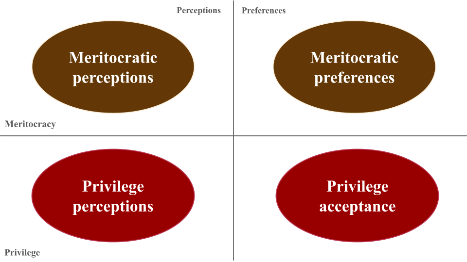


:::{.notes}

As a bit of context, this second part relates to my master's thesis project, so I would really appreciate any comment or suggestion.

Let us observe the multidimensional framework of meritocracy again, composed of perceptions and preferences, on the one hand, and the distinction by meritocratic and privilege factors, on the other.

So we already know that people can hold meritocratic and privilege beliefs at the same time, **but what we don’t know** is how these different types of beliefs are organized in the people's minds.

So, I move toward the use of methods to observe **how** meritocratic beliefs —such as the perception of effort— are organized in the population

By this I mean the following:
:::


## Latent Class Analysis


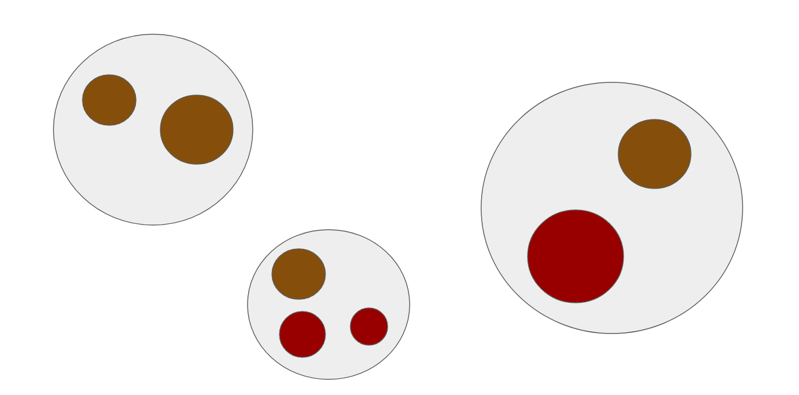


:::{.notes}

Let’s imagine that meritocratic beliefs are the brown ones and privilege beliefs are the red ones 

Like I said before, we know that the coexistence of privilege and meritocratic beliefs is possible

but **we still don't know what** beliefs predominate among people, and which ones are most representative at the population level

So, to find that out, I plan to use Latent Class Analysis, a method that allows us to observe the heterogen*é*ity of beliefs in the population by classifying subgroups

By “heterogen*é*ity,” I also mean differences in beliefs regarding the number of groups that can be identified and the size of each group in the population
:::

## LCA estimation

- Parameters:
  
  - $P_{jk}$: conditional probability of response $j$ given class $k$ 
  - $\pi_k$: estimated class proportion for class $k$
  
- Model selection based on BIC, AIC, and entropy

<br>
<br>
<br>
<br>

Collins, L., & Lanza, S. (2010). _Latent class and latent transition analysis: With applications in the social behavioral, and health sciences_. London: Wiley.


:::{.notes}

So, using this method, we can identify two main parameters:

F**e**rst, the conditional probability of response for individuals within each class. This parameter allows us to provide a substantive interpretation of each latent group.

Second, the estimated proportion of the class, which tells us the size of each class within the population.

This modeling process is carried out using fit indices such as the Akaike Index Criterion, the Bayesian Index Criterion, and entropy, each of which provides information to identify the optimal model

Now I want to present you the preliminary results of the latent class estimation
:::

## 

:::{.incremental}
```{r}
#| label: fig-lca-1
#| fig-cap: "Conditional probabilities of the 4-class solution. EDUMERCO data (N = 2470)"
#| fig-align: center
#| out-width: '100%'
#| fig-cap-location: bottom

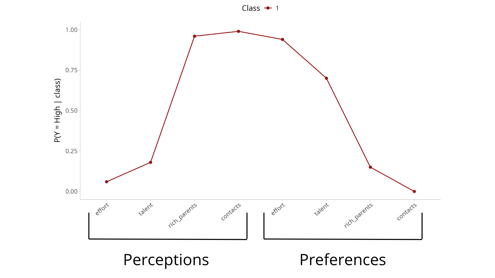
```

:::{style="font-size: 18px;"}
- [Class 1 Critical Meritocrats]{style="color: #961010;"} (36.2%)

[Urzúa, T., Castillo, J. C. (2026). Identifying Patterns of Beliefs Based on Merit and Privilege: A Latent Class Analysis Approach. *Work in progress*](https://github.com/jus-mer/lca-merit-pensions)
:::

:::

:::{.notes}

So, starting with the f{e}rst class, it combines a low perception of meritocracy with a high perception of the influence of privilege. Its members believe that success does not depend on effort and talent, but rather on factors such as social background and networks. However, at the normative level, they strongly support meritocracy and reject the le**gí**timacy of non-meritocratic advantages, especially those linked to personal connections.

the name of this class is critical meritocrats and has a size of 36% This group is cháracterized by its belief in meritocracy as a moral **ai**deal, while acknowledging that, in reality, certain prívileges influence success. It does not consider the current system to be meritocratic, but it **strongly ádvocats for it to be so**

:::

## 

:::{.incremental}
```{r}
#| label: fig-lca-2
#| fig-cap: "Conditional probabilities of the 4-class solution. EDUMERCO data (N = 2470)"
#| fig-align: center
#| out-width: '100%'
#| fig-cap-location: bottom

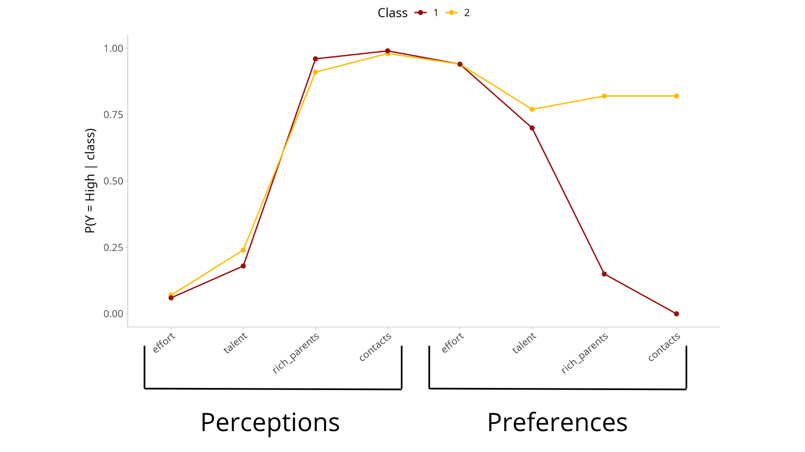
```

:::{style="font-size: 18px;"}
- [Class 2: Privilege advocates]{style="color: #ffbb00;"} (36.3%)

[Urzúa, T., Castillo, J. C. (2026). Identifying Patterns of Beliefs Based on Merit and Privilege: A Latent Class Analysis Approach. *Work in progress*](https://github.com/jus-mer/lca-merit-pensions)
:::
:::


:::{.notes}

The second class follows the same descriptive framework as the first, perceiving low levels of meritocratic functions and high levels of privilege indicators. The main difference lies in the fact that this class accepts that society operates according to norms based on family background and social capital.

This class is called Privilege advocates and has a size of 36%, combines a realistic assessment of a stratified society with a normative justification of privilege. Thus, meritocracy is not presented as an alternative to privilege; rather, **the two principles coexist** and are viewed as compatible foundations for the functioning of society.

:::


## 

:::{.incremental}
```{r}
#| label: fig-lca-3
#| fig-cap: "Conditional probabilities of the 4-class solution. EDUMERCO data (N = 2470)"
#| fig-align: center
#| out-width: '100%'
#| fig-cap-location: bottom

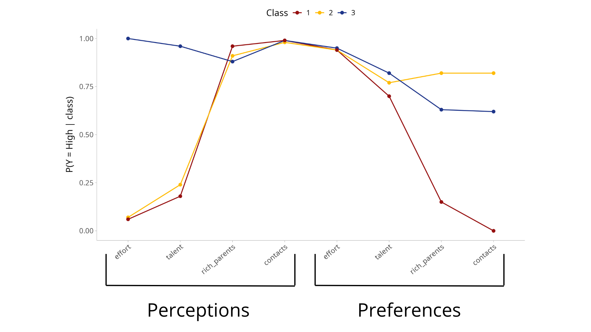
```

:::{style="font-size: 18px;"}
- [Class 3 Universal rewards]{style="color: #1e358a;"} (20.7%)

[Urzúa, T., Castillo, J. C. (2026). Identifying Patterns of Beliefs Based on Merit and Privilege: A Latent Class Analysis Approach. *Work in progress*](https://github.com/jus-mer/lca-merit-pensions)
:::
:::

:::{.notes}

Now, as we can see, people in the th**e**rd group recognize both meritocratic and privilege elements in society, which sets them apart from the previous two groups. And  normatively, they strongly endorse meritocracy, while taking a more ambivalent stance toward privilege, but they still show support for non-meritocracy

- This class is called Universal rewards and has a size of 21%. This profile reflects a belief system in which merit and privilege operate simultaneously. They strongly support meritocracy, though they hold an ambivalent stance toward privilege: they view it as less legitimate than other groups do, but they **do not reject it entirely**, considering the system to be partially meritocratic and acceptable.

:::

##

:::{.incremental}

```{r}
#| label: fig-lca-4
#| fig-cap: "Conditional probabilities of the 4-class solution. EDUMERCO data (N = 2470)"
#| fig-align: center
#| out-width: '100%'
#| fig-cap-location: bottom

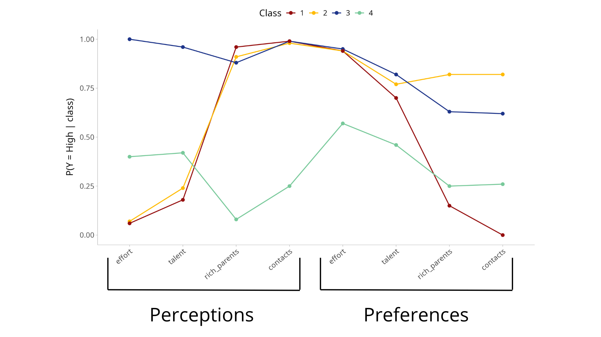
```

:::{style="font-size: 18px;"}
- [Class 4 Against privilege]{style="color: #78c99a; font-size: 18px;"} (6.8%)

[Urzúa, T., Castillo, J. C. (2026). Identifying Patterns of Beliefs Based on Merit and Privilege: A Latent Class Analysis Approach. *Work in progress*](https://github.com/jus-mer/lca-merit-pensions)
:::
:::

:::{.notes}

Finally, the fourth class is the smallest with only a 7% and is characterized by a low perception of meritocracy and a low perception of the influence of privilege, specially the rich parents item. Well, the most significant aspect of this group is that it does not perceive privilege as a factor in the distribution of resources in society, nor does it believe that it should be. Based on that, the name of this class is Against privilege

Now, the next steps are to study the relationship between these classes and market justice in education based on regression models
:::

## Conjoint survey experiment

- Estimate the relative weight of different deservingness criteria for allocating public goods in Chile

- Study the association between meritocratic beliefs and deservingness criteria

- Current study: conjoint-allocation survey experiment (inspired by Gilgen & Zangger, 2025) to be fielded in 2026

- Stage: pre-pilot (this week)
 
<br>
<br>
<br>

Gilgen, S., & Zangger, C. (2025). From principles to practice: Distributive justice and the role of perceived inequality in reward allocation. _Frontiers in Sociology_, 10, 1660806. https://doi.org/10.3389/fsoc.2025.1660806

## Pilot survey

```{=html}
<iframe src="images/survey.html" width="100%" height="800" frameborder="0" style="border: none; background: #ffffff; opacity: 1; filter: none; mix-blend-mode: normal;"></iframe>
```

-> link to pre-pilot survey (allows translation in chrome): [https://jus-mer-pre-piloto-v2.share.connect.posit.cloud](https://jus-mer-pre-piloto-v2.share.connect.posit.cloud)

## Attributes and levels


<table style="width:100%; border-collapse:collapse; font-size:0.85rem; line-height:1.5;">
  <thead>
    <tr style="border-top:2px solid #000; border-bottom:1px solid #000; background:#f5f5f5;">
      <th style="padding:0.5rem 0.6rem; text-align:left; width:12%;">Attribute</th>
      <th style="padding:0.5rem 0.6rem; text-align:left; width:14%;">Criterion</th>
      <th style="padding:0.5rem 0.6rem; text-align:left; width:20%;">Profile label</th>
      <th style="padding:0.5rem 0.6rem; text-align:left; width:34%;">Levels</th>
      <th style="padding:0.5rem 0.6rem; text-align:left; width:20%;">Reference category</th>
    </tr>
  </thead>
  <tbody>
    <tr style="border-bottom:1px solid #ddd;">
      <td style="padding:0.5rem 0.6rem; vertical-align:top;"><strong>Need</strong></td>
      <td style="padding:0.5rem 0.6rem; vertical-align:top;">Need (CARIN/NICER)</td>
      <td style="padding:0.5rem 0.6rem; vertical-align:top;">Makes ends meet with <em>(Su hogar llega a fin de mes con:)</em></td>
      <td style="padding:0.5rem 0.6rem; vertical-align:top;">Hardship <em>(Dificultad)</em><br>Comfort <em>(Holgura)</em></td>
      <td style="padding:0.5rem 0.6rem; vertical-align:top;">Comfort <em>(Holgura)</em></td>
    </tr>
    <tr style="border-bottom:1px solid #ddd; background:#fafafa;">
      <td style="padding:0.5rem 0.6rem; vertical-align:top;"><strong>Effort</strong></td>
      <td style="padding:0.5rem 0.6rem; vertical-align:top;">Effort (NICER)</td>
      <td style="padding:0.5rem 0.6rem; vertical-align:top;">Studies <em>(Estudia:)</em></td>
      <td style="padding:0.5rem 0.6rem; vertical-align:top;">More than their peers <em>(Más que sus compañeros)</em><br>The same as their peers <em>(Igual que sus compañeros)</em><br>Less than their peers <em>(Menos que sus compañeros)</em></td>
      <td style="padding:0.5rem 0.6rem; vertical-align:top;">Less than their peers <em>(Menos que sus compañeros)</em></td>
    </tr>
    <tr style="border-bottom:1px solid #ddd;">
      <td style="padding:0.5rem 0.6rem; vertical-align:top;"><strong>Control</strong></td>
      <td style="padding:0.5rem 0.6rem; vertical-align:top;">Control (CARIN/NICER)</td>
      <td style="padding:0.5rem 0.6rem; vertical-align:top;">Needs the scholarship because <em>(Requiere la beca porque:)</em></td>
      <td style="padding:0.5rem 0.6rem; vertical-align:top;">Applied to other scholarships but received no funding <em>(Postuló a otras becas pero no obtuvo financiamiento)</em><br>Did not apply to other scholarships in time <em>(No alcanzó a postular a tiempo a otras becas)</em></td>
      <td style="padding:0.5rem 0.6rem; vertical-align:top;">Did not apply in time <em>(No alcanzó a postular a tiempo)</em></td>
    </tr>
    <tr style="border-bottom:1px solid #ddd; background:#fafafa;">
      <td style="padding:0.5rem 0.6rem; vertical-align:top;"><strong>Reciprocity</strong></td>
      <td style="padding:0.5rem 0.6rem; vertical-align:top;">Reciprocity (CARIN/NICER)</td>
      <td style="padding:0.5rem 0.6rem; vertical-align:top;">Outside their studies <em>(Fuera de sus estudios:)</em></td>
      <td style="padding:0.5rem 0.6rem; vertical-align:top;">Has done volunteer work <em>(Ha hecho voluntariado)</em><br>Has not done volunteer work <em>(No ha hecho voluntariado)</em></td>
      <td style="padding:0.5rem 0.6rem; vertical-align:top;">Has not done volunteer work <em>(No ha hecho voluntariado)</em></td>
    </tr>
    <tr style="border-bottom:1px solid #ddd;">
      <td style="padding:0.5rem 0.6rem; vertical-align:top;"><strong>Attitude</strong></td>
      <td style="padding:0.5rem 0.6rem; vertical-align:top;">Attitude (CARIN)</td>
      <td style="padding:0.5rem 0.6rem; vertical-align:top;">Sees the scholarship as <em>(Ve la beca como:)</em></td>
      <td style="padding:0.5rem 0.6rem; vertical-align:top;">Help they are grateful for <em>(Una ayuda que agradece)</em><br>Something they deserve <em>(Algo que se merece)</em></td>
      <td style="padding:0.5rem 0.6rem; vertical-align:top;">Something they deserve <em>(Algo que se merece)</em></td>
    </tr>
    <tr style="border-bottom:1px solid #ddd; background:#fafafa;">
      <td style="padding:0.5rem 0.6rem; vertical-align:top;"><strong>Identity</strong></td>
      <td style="padding:0.5rem 0.6rem; vertical-align:top;">Identity (CARIN/NICER)</td>
      <td style="padding:0.5rem 0.6rem; vertical-align:top;">Country of birth <em>(País de nacimiento:)</em></td>
      <td style="padding:0.5rem 0.6rem; vertical-align:top;">Chile<br>Venezuela<br>Peru <em>(Perú)</em></td>
      <td style="padding:0.5rem 0.6rem; vertical-align:top;">Chile</td>
    </tr>
    <tr style="border-bottom:2px solid #000;">
      <td style="padding:0.5rem 0.6rem; vertical-align:top;"><strong>Sex</strong></td>
      <td style="padding:0.5rem 0.6rem; vertical-align:top;">Ascriptive (signaled by name)</td>
      <td style="padding:0.5rem 0.6rem; vertical-align:top;">First name (no explicit row)</td>
      <td style="padding:0.5rem 0.6rem; vertical-align:top;">Female name<br>Male name</td>
      <td style="padding:0.5rem 0.6rem; vertical-align:top;">Male</td>
    </tr>
  </tbody>
</table>
<p style="font-size:0.8rem; color:#555; margin-top:0.8rem;"><em>Note: Levels are given in English, with the ooriginal Spanish wording shown to respondents in parentheses. The factorial space comprises 2 (Need) × 3 (Effort) × 2 (Control) × 2 (Reciprocity) × 2 (Attitude) × 3 (Identity) × 2 (Sex) = 288 unique profiles. Attributes are assigned independently and uniformly at the profile level. Sex is signaled through gendered first names drawn from matched pools rather than as an explicit table row.</em></p>

## Next steps

::: {.fragment}
### Survey (2026)

::: {style="margin-left: 2em;"}
- conjoint-allocation experiment

- expand market justice measurement

- longitudinal design (2026-2028)
:::
:::

::: {.fragment}
### Latent class analysis of meritocracy 

::: {style="margin-left: 2em;"}
+ compare adult and student populations
+ latent transition analysis EDUMER panel data
+ relationship with deservingness criteria
:::
:::

::: {.fragment}
### Market justice in international comparative perspective (ISSP 1999-2019)

::: {style="margin-left: 2em;"}
+ health
+ education
:::
:::


# Thanks, comments most welcome!


::: {.columns}
::: {.column style="text-align: center;"}

Project website: [https://jus-mer.com](https://jus-mer.com)

{width='50%'}

:::


::: {.column style="text-align: center;"}

Project Github: [https://github.com/jus-mer](https://github.com/jus-mer)

{width='50%'}


:::

:::


#


::: columns


::: {.column width="20%"}

<br>
<br>
<br>
<br>
<br>
<br>

{width='70%'}

{width='80%'}


:::

::: {.column .column-right width="80%"}


<br>

# Conceptualizing and measuring meritocracy {style="font-size:21px; text-align:right; line-height:1.1;"}

### **Background, developments and extensions** {style="font-size:35px; text-align:right; line-height:1.1; margin-top:12px;"}

------------------------------------------------------------------------

</br>
**Juan Carlos Castillo**

**Tomás Urzúa**

::: {.blue2 .medium style="line-height:0.4; margin-top:0; margin-bottom:0;"}

**Department of Sociology, University of Chile** </br>

:::

</br>

September 2026 - Online presentation for the EDUMERIT ERC Project, Tallin University.


:::
:::

