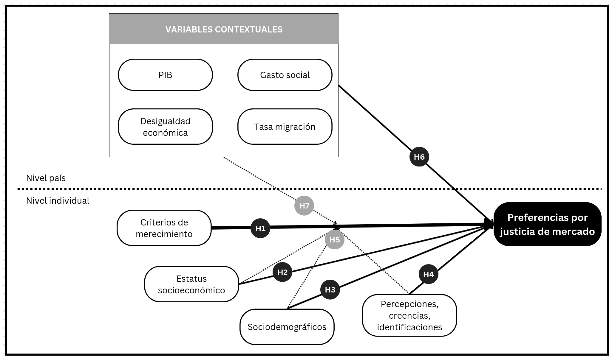

```{r}
#| label: setup
#| include: false
library(knitr)
knitr::opts_chunk$set(echo = F,
                      warning = F,
                      error = F, 
                      message = F) 
```

```{r}
#| label: packages
#| include: false

if (! require("pacman")) install.packages("pacman")

pacman::p_load(tidyverse, 
               here,
               kableExtra)

options(scipen=999)
rm(list = ls())
```


::: columns


::: {.column width="30%"}

</br></br>


:::

::: {.column .column-right width="70%"}


# **Presentación de proyecto, diseño de encuesta y temas de seminaristas**

------------------------------------------------------------------------

**IP: Juan Carlos Castillo^1,^^3^** 

**AI: Andreas Laffert^2,^^3^** 

::: {.blue2 .medium}

**^1^Departamento de Sociología, UCH**

**^2^Instituto de Sociología, PUC**

**^3^Centro de Estudios de Conflicto y Cohesión Social - COES**

:::

Reunión con seminaristas y tesistas

16 Octubre 2025, Santiago

:::
:::


# Contexto {.xlarge data-background-color="#92220C"}


## Proyecto

::: {.columns}

::: {.column width="30%"}


:::

::: {.column width="70%"}
::: {.incremental .highlight-last style="font-size: 110%;"}
- ANID/FONDECYT N°1250518 2025-2028 - Justicia de mercado y merecimiento del bienestar social

- Primera etapa:
  * Estudios con datos secundarios comparados y nacionales
  * Encuesta "Mercado, merecimiento y mérito"
 
- Segunda etapa:
  * Estudios con análisis de experimento de encuesta
  * Análisis discusiones legislativas pensiones
  
- Más información: [jc-castillo.com/project/fondecyt-jusmer/](jc-castillo.com/project/fondecyt-jusmer/)

:::
:::
:::

## Contexto 

::: {.box-inv-4 .sp-after .fragment style="font-size: 110%;"}

1) Privatización y mercantilización de  bienes públicos, políticas de bienestar y servicios sociales [@gingrich_making_2011; @streeck_how_2016]

:::

::: {.box-inv-4 .sp-after .fragment style="font-size: 110%;"}

2) Cambios en la arquitectura de las instituciones del bienestar social; expansión del mercado [@ferre_welfare_2023; @busemeyer_welfare_2020]

:::


::: {.box-inv-4 .sp-after .fragment style="font-size: 110%;"}

3) Este orden económico se refleja en una economía moral específica/policy-feedback effects [@mau_inequality_2015; @campbell_institutional_2020; @fernandez_positive_2013] 

:::

::: {.box-inv-5 .sp-after-half .fragment style="font-size: 110%;"}

Preferencias por justicia de mercado [@busemeyer_skills_2014; @castillo_perceptions_2025; @koos_moral_2019; @lindh_public_2015]

:::


## Contexto chileno

::: {.incremental .highlight-last style="font-size: 120%;"}
- Profunda privatización y comodificación de áreas de reproducción social con fuerte dependencia Estatal [@madariaga_three_2020; @boccardo_30_2020]
- Crecimiento con elevada desigualdad y bajo gasto social [@llorca-jana_historia_2021; @flores_top_2020]
- Malestar por desigualdad en acceso y provisión de servicios sociales [@pnud_desiguales_2017], y conflictividad social [@somma_no_2021] y
- Consecuencias del neoliberalismo en las subjetividades [@canalesceron_sujeto_2021;@araujo_hilos_2019]
- Justicia distributiva y actitudes hacia la desigualdad [@atria_economic_2020;@castillo_legitimacy_2011;@castillo_meritocracia_2019; @mac-clure_justicia_2024; @otero_power_2024]
:::


## Este proyecto

</br>

::: {.pull-left .box-inv-5 .sp-after .fragment style="font-size: 125%;"}

Abordar sistemáticamente las preferencias por criterios de mercado en salud, pensiones y educación, sus determinantes y cómo han cambiado en el tiempo en Chile


:::

</br></br>

::: {.pull-right .box-inv-5 .sp-after .fragment style="font-size: 125%;"}

Las preferencias por justicia de mercado se asocian a criterios de merecimiento fuertemente arraigados en la población

:::


#  {data-background-color="#92220C"}

:::: {.incremental style="font-size: 140%;"}

**Objetivo**: Analizar en Chile (y en perspectiva comparada) el nivel y la evolución de las preferencias por justicia de mercado en las últimas dos décadas y su vínculo con criterios de merecimiento del bienestar

**Argumento**: El alto grado de comodificación del bienestar en Chile habría reforzado normas meritocráticas (especialmente el énfasis en el esfuerzo), elevando el apoyo a la justicia de mercado frente a países con menor comodificación

::::

## Objetivos específicos

::: {.incremental .highlight-last style="font-size: 110%;"}

1. Analizar la asociación entre criterios de merecimiento y preferencias por justicia de mercado

2. Estimar en qué medida el estatus socioeconómico se vincula con dichas preferencias

3. Examinar el efecto de variables socio-estructurales (edad, género) sobre esas preferencias

4. Indagar cómo percepciones/creencias sobre la desigualdad se asocian a la justicia de mercado

5. Evaluar el rol moderador de estatus (objetivo y subjetivo) y factores socio-estructurales en la relación merecimiento → justicia de mercado
6. Analizar la asociación entre desigualdad contextual a nivel país y preferencias por justicia de mercado

7. Explorar el rol moderador de factores contextuales de país en la relación merecimiento → justicia de mercado

:::

# Antecedentes {.xlarge data-background-color="#92220C"}

## Preferencias por justicia de mercado

::: {.incremental .highlight-last style="font-size: 120%;"}

- Lane [-@lane_market_1986]: market justice vs. political justice

- "Bringing the market in" [@lindh_bringing_2023] 

- Creencias normativas que legitiman la idea de que el acceso a los servicios sociales esenciales —como la salud, la educación o las pensiones— debe determinarse según criterios basados en el mercado [@lindh_public_2015, p.895]

- Medición: evaluar si las personas consideran justo que el acceso a dichos servicios dependa de los ingresos [@lindh_public_2015; @kluegel_legitimation_1999; @castillo_perceptions_2025]

:::


## Preferencias por justicia de mercado
::::: columns
::: {.column width="50%" .incremental .highlight-last style="font-size: 110%;"}
### Contextual
- Gasto social [@immergut_it_2020; @busemeyer_skills_2014; @busemeyer_welfare_2020]
- Desigualdad económica [@koos_moral_2019]
- Nivel de privatización de servicios y regulación del mercado [@lindh_public_2015; @koos_moral_2019]
:::
::: {.column width="50%" .incremental .highlight-last style="font-size: 110%;"}
### Individual
- Estatus socioeconómico -ingresos, educación y ocupación- [@lindh_public_2015; @koos_moral_2019; @busemeyer_welfare_2020; @svallfors_political_2007, @otero_power_2024]
- Percepciones sobre la desigualdad y meritocracia [@castillo_perceptions_2025; @castillo_socialization_2024]
- Conservadurismo/liberalismo económico [@lee_fairness_2023]
:::
:::::


## Merecimiento

::: {.incremental .highlight-last style="font-size: 120%;"}

- Merecimiento en bienestar: La universalidad no es la norma; el acceso suele ser condicional según quién “merece” qué y por qué

- Evaluaciones que las personas realizan sobre si ciertos beneficios, castigos o reconocimientos son justamente merecidos o no [@oorschot_who_2000]

- Marco CARIN: Cinco criterios para juzgar merecimiento: Control, Actitud, Reciprocidad, Identidad y Necesidad

- Primacía del control/mérito: La responsabilidad individual (esfuerzo) suele pesar más que necesidad o reciprocidad al decidir quién merece apoyo

- Implicación del proyecto: Evaluar cómo estos criterios—en especial control/mérito—se asocian con preferencias por justicia de mercado

:::

## Hipótesis

::: {.fragment}
<div style="text-align:center;">
  
</div>

:::

## Contribución y proyecciones

::: {.incremental .highlight-last style="font-size: 120%;"}

1. Aproximación conceptual a la justicia de mercado desde el contexto chileno
2. Analizar empíricamente las preferencias por justicia de mercado/mercantilización del bienestar en Chile desde la opinión pública mediante encuestas
3. Efectos normativos de las instituciones del bienestar debido a la privatización y mercantilización y su relación con el merecimiento
4. Posicionarse como una plataforma de investigación y difusión sobre justicia distributiva en Chile, en colaboración con otros centros, proyectos e investigadores (nacionales e internacionales)
:::

# Metodología {.xlarge data-background-color="#92220C"}

## Líneas de trabajo

::: {style="font-size: 100%;"}

| Estudio                                   | Datos                                   | VD                   | VI                           | Método                       |
|-------------------------------------------|-----------------------------------------|--------------------------------|---------------------------------------|------------------------------|
| 1.Comparación internacional                 | ISSP 1987–2019 | Justicia de mercado educ/salud | Meritocracia, necesidad; macro (ineq) | Multinivel híbrido  |
| 2.Cambio en Chile (1999–2019)               | ISSP–Chile 1999/2009/2019         | Justicia de mercado             | Todas        | Regresión ordinal (año=factor)|
| 3.Mercado, merecimiento y mérito        | Encuesta online (n≈1.500)                | Justicia de mercado (varios dominios) | CARIN, neoliberalismo, meritocracia   | -      |
| 4.Experimento distribucional (DSE)          | Módulo en MMM                           | Asignación entre 3 ámbitos      | Vignettes (L1) + CARIN (L2)           | Multinivel |
| 5.Debate 6% pensiones | Actas de Congreso                       | Tipos/frecuencia de argumentos | CARIN; posición política              | CTA / topic modeling         |

::: 

## Líneas de trabajo en curso o terminados

::: {style="font-size: 100%;"}

| Estudio                                   | Datos                                   | VD                  | VI                           | Método                             |
|-------------------------------------------|-----------------------------------------|--------------------------------|---------------------------------------|------------------------------------|
| MJP meritocracia x desigualdad     | ELSOC                     | Justicia de mercado (índice)           | Meritocracia × desigualdad percibida  | Multinivel longitudinal       |
| Merit–Factorial     | Encuesta EDUMER              | Escala meritocracia      | Cohorte/edad             | CFA e invarianza                 |
| MJP: clase x meritocracia                 | ELSOC                    | Justicia de mercado en pensiones           | Clase x meritocracia percibida   | Multinivel longitudinal        |
| MJP Mobility                     | ELSOC     | Justicia de mercado en pensiones    | Movilidad ↑/↓ y meritocracia           | Causal; IPW/WLS               |
| LCA meritocracia escolar                  | Encuesta EDUMERCO             | Escala meritocracia | - | LCA   |

:::


# Planificación {.xlarge data-background-color="#92220C"}

[link aquí](https://docs.google.com/spreadsheets/d/13u0dccNtzotxqF7GUoeDVcaf-OYhsG830AVJK4H2vw4/edit?usp=sharing)

# Diseño encuesta _Mercado, merecimiento y mérito_ {.xlarge data-background-color="#92220C"}

## Diseño encuesta

::: {.incremental .highlight-last style="font-size: 120%;"}

- **Objetivo**: contar con datos y mediciones de calidad de los constructos relevantes para los estudios del proyecto

- **Diseño**:
    
    * Encuesta web transveral 
    * Administración de entrevistas CAWI
    * Aplicación será encargada a una empresa especialista (ej. Netquest). Sin programación del cuestionario, solo muestra
    * Muestreo por cuotas (sexo, edad y nivel socioeconómico)
    * N $\approx$ 3.000 casos
    * Cuestionario de 30 minutos y 40 preguntas $\approx$

:::

## Ventajas y limitaciones diseño encuesta


::::: columns
::: {.column width="50%" .incremental .highlight-last style="font-size: 110%;"}
### Ventajas
- Escala y eficiencia/costos [@callegaro_web_2015; @biffignandi_handbook_2021]
- Flexibilidad de diseño [@hohne_switching_2020]
- Reduce sesgo del encuestador (especialmente en experimentos de encuesta) [@callegaro_web_2015]
- Acceso/participación  [@biffignandi_handbook_2021]

:::
::: {.column width="50%" .incremental .highlight-last style="font-size: 110%;"}
### Desventajas
- Error de cobertura: penalización a grupos desventajados [@tourangeau_science_2013]
- Sesgo de autoselección y consecuencias de incentivos [@smyth_internet_2011; @tourangeau_science_2013]
- Problemas de no respuesta [@west_methods_2023]
:::
:::::


## Diseño encuesta

::: {style="font-size: 90%;"}

| Módulo                  | Ítems clave                                       | Fuente |
|-----------------------------------|---------------------------------------------------------------|-----------------|
| **Sociodemográficos**             | Sexo, edad, ingresos, educación, ocupación, ID política, religión, etnia, escuela de origen, nacionalidad, tamaño hogar, estatus social subjetivo | — |
| **Justicia de mercado**           | Ítems en salud, educación, pensiones; mejoras de medición por dominio | — |
| **CARIN**               | Control, Actitud, Reciprocidad, Identidad, Necesidad      | [@meuleman_welfare_2020a] |
| **Meritocracia**| Percepciones y preferencias meritocráticas y no meritocráticas | [@castillo_multidimensional_2023] |
| **Neoliberalismo**                | Actitudes pro-mercado / responsabilidad individual            | [@grzanka_measuring_2020] |
| **Actitudes desigualdad**  | Percepción de desigualdad, preferencias redistributivas, mercado vs Estado | ISSP|
| **Experimento distribucional**    | Asignación de recursos | [@gilgen_distributional_2020] |


:::
 
# Discusión {data-background-color="#92220C"}

:::: {.incremental style="font-size: 160%;"}

**1. ¿Sus investigaciones requieren levantar datos?**

**2. ¿Otros ítems/constructos necesarios a incluir en la encuesta?**

**3. Operacionalización y medición**

**4. Acercanos al cómo preguntar correctamente**

::::

# Gracias por su atención! 

-   **Github del proyecto:** <https://github.com/jus-mer>

## Referencias

