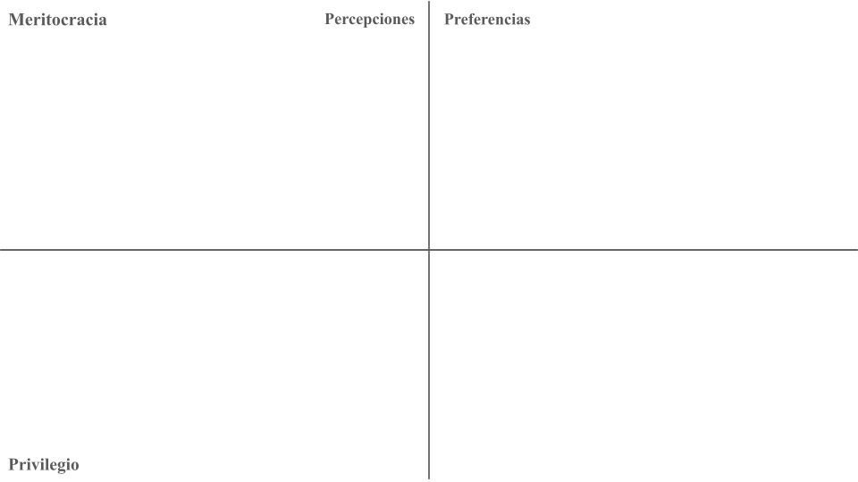
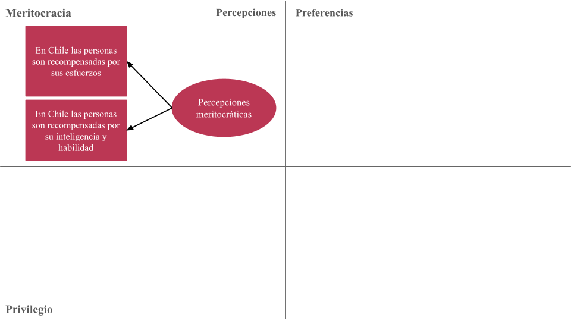
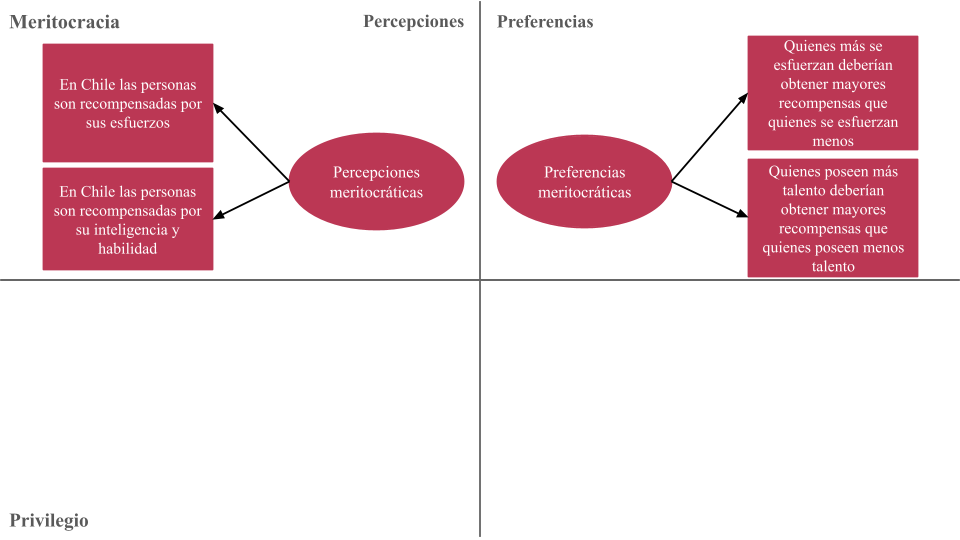
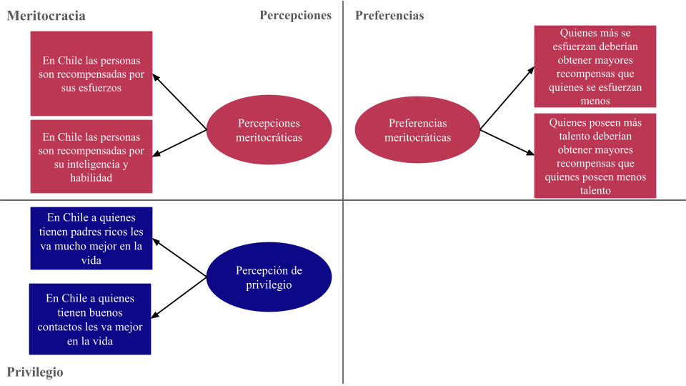
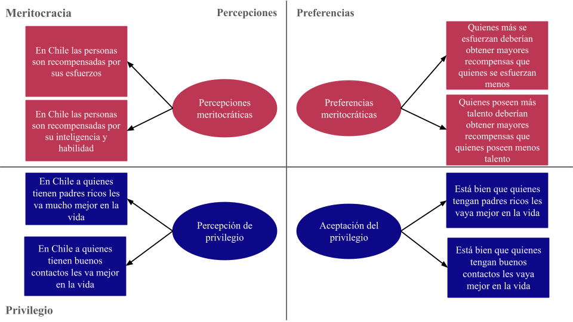
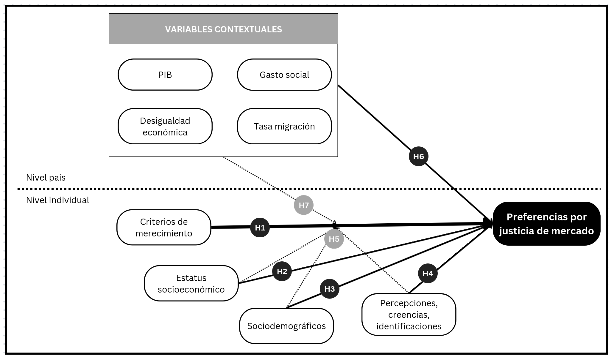
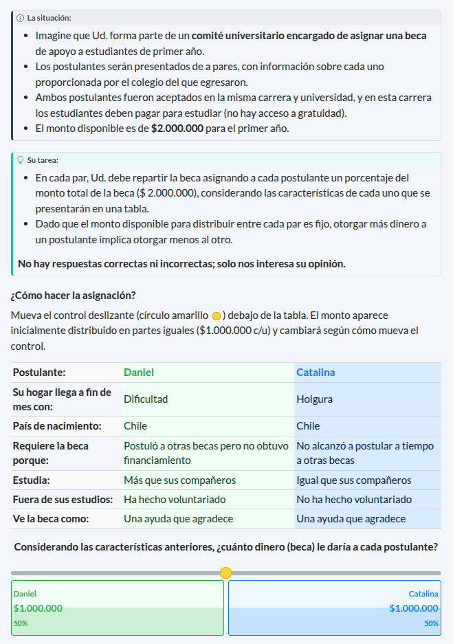

```{r}
#| label: setup
#| include: false
library(knitr)
knitr::opts_chunk$set(echo = F,
                      warning = F,
                      error = F, 
                      message = F) 
```

```{r}
#| label: packages
#| include: false

if (! require("pacman")) install.packages("pacman")

pacman::p_load(tidyverse, 
               here,
               kableExtra)

options(scipen=999)
rm(list = ls())
```


::: columns


::: {.column width="30%"}

</br></br>


:::

::: {.column .column-right width="70%"}


# **Presentación del proyecto**

### Reunión con ayudantes y seminaristas

------------------------------------------------------------------------

**IP: Juan Carlos Castillo** 

**AI: Tomás Urzúa** 

::: {.blue2 .medium}

**Departamento de Sociología, UCH**

:::

<br>

Reunión ayudantes y seminaristas

06 Agosto 2026

:::
:::


# Contexto {.xlarge data-background-color="#8b231e"}


## Proyecto

::: {.columns}

::: {.column width="30%"}


:::

::: {.column width="70%"}
::: {.incremental .highlight-last style="font-size: 110%;"}
- ANID/FONDECYT N°1250518 2025-2028 - Justicia de mercado y merecimiento del bienestar social

- Primera etapa:
  * Estudios con datos secundarios comparados y nacionales
  * Encuesta "Mercado, merecimiento y mérito"
 
- Segunda etapa:
  * Estudios con análisis de experimento de encuesta
  * Análisis discusiones legislativas pensiones
  
- Más información: [jus-mer.com](https://jus-mer.com/)

:::
:::
:::

## Contexto 

::: {.box-inv-4 .sp-after .fragment style="font-size: 110%;"}

1) Privatización y mercantilización de  bienes públicos, políticas de bienestar y servicios sociales [@gingrich_making_2011; @streeck_how_2016]

:::

::: {.box-inv-4 .sp-after .fragment style="font-size: 110%;"}

2) Cambios en la arquitectura de las instituciones del bienestar social; expansión del mercado [@ferre_welfare_2023; @busemeyer_welfare_2020]

:::


::: {.box-inv-4 .sp-after .fragment style="font-size: 110%;"}

3) Este orden económico se refleja en una economía moral específica/policy-feedback effects [@mau_inequality_2015; @campbell_institutional_2020; @fernandez_positive_2013] 

:::

::: {.box-inv-5 .sp-after-half .fragment style="font-size: 110%;"}

Preferencias por justicia de mercado [@castillo_perceptions_2025; @koos_moral_2019; @lindh_public_2015]

:::


## Contexto chileno

::: {.incremental .highlight-last style="font-size: 120%;"}
- Profunda privatización y comodificación de áreas de reproducción social con fuerte dependencia Estatal [@madariaga_three_2020; @boccardo_30_2020]
- Crecimiento con elevada desigualdad y bajo gasto social [@llorca-jana_historia_2021; @flores_top_2020]
- Malestar por desigualdad en acceso y provisión de servicios sociales [@pnud_desiguales_2017], y conflictividad social [@somma_no_2021] y
- Consecuencias del neoliberalismo en las subjetividades [@canalesceron_sujeto_2021;@araujo_hilos_2019]
:::

## Comodificación de servicios en Chile

::: {.incremental .highlight-last style="font-size: 120%;"}
- Pensiones: un sistema de **capitalización individual obligatoria** gestionado por **fondos de pensiones privados** (AFP) [@superintendencia_cuadros_2025]

- Salud: un **sistema dual** de seguros públicos y privados, en el que el sistema público (FONASA) da cobertura al 70 % de la población [@superintendencia_cuadros_2025]

- Educación: un triple **sistema estratificado** compuesto por centros públicos, privados subvencionados y privados, con importantes disparidades en cuanto a calidad y acceso [@valenzuela_socioeconomic_2013]
:::


## Este proyecto

</br>

::: {.pull-left .box-inv-5 .sp-after .fragment style="font-size: 125%;"}

Abordar sistemáticamente las preferencias por criterios de mercado en salud, pensiones y educación, sus determinantes y cómo han cambiado en el tiempo en Chile


:::

</br></br>

::: {.pull-right .box-inv-5 .sp-after .fragment style="font-size: 125%;"}

Las preferencias por justicia de mercado se asocian a criterios de merecimiento fuertemente arraigados en la población

:::


#  {data-background-color="#8b231e"}

:::: {.incremental style="font-size: 140%;"}

**Objetivo**: Analizar en Chile (y en perspectiva comparada) el nivel y la evolución de las preferencias por justicia de mercado en las últimas dos décadas y su vínculo con criterios de merecimiento del bienestar

**Argumento**: El alto grado de comodificación del bienestar en Chile habría reforzado normas meritocráticas (especialmente el énfasis en el esfuerzo), elevando el apoyo a la justicia de mercado frente a países con menor comodificación

::::

## Objetivos específicos

::: {.incremental .highlight-last style="font-size: 110%;"}

1. Analizar la asociación entre criterios de merecimiento y preferencias por justicia de mercado

2. Estimar en qué medida el estatus socioeconómico se vincula con dichas preferencias

3. Examinar el efecto de variables socio-estructurales (edad, género) sobre esas preferencias

4. Indagar cómo percepciones/creencias sobre la desigualdad se asocian a la justicia de mercado

5. Evaluar el rol moderador de estatus (objetivo y subjetivo) y factores socio-estructurales en la relación merecimiento → justicia de mercado
6. Analizar la asociación entre desigualdad contextual a nivel país y preferencias por justicia de mercado

7. Explorar el rol moderador de factores contextuales de país en la relación merecimiento → justicia de mercado

:::

# Conceptos centrales {.xlarge data-background-color="#92220C"}

## Preferencias por justicia de mercado

::: {.incremental .highlight-last style="font-size: 120%;"}

- Lane [-@lane_market_1986]: market justice vs. political justice

- "Bringing the market in" [@lindh_bringing_2023] 

- Creencias normativas que legitiman la idea de que el acceso a los servicios sociales esenciales —como la salud, la educación o las pensiones— debe determinarse según criterios basados en el mercado [@lindh_public_2015, p.895]

- Medición: evaluar si las personas consideran justo que el acceso a dichos servicios dependa de los ingresos [@lindh_public_2015; @kluegel_legitimation_1999; @castillo_perceptions_2025]

:::


## Preferencias por justicia de mercado
::::: columns
::: {.column width="50%" .incremental .highlight-last style="font-size: 110%;"}
### Contextual
- Gasto social [@immergut_it_2020; @busemeyer_welfare_2020]
- Desigualdad económica [@koos_moral_2019]
- Nivel de privatización de servicios y regulación del mercado [@lindh_public_2015; @koos_moral_2019]
:::
::: {.column width="50%" .incremental .highlight-last style="font-size: 110%;"}
### Individual
- Estatus socioeconómico -ingresos, educación y ocupación- [@lindh_public_2015; @koos_moral_2019; @busemeyer_welfare_2020; @svallfors_political_2007, @otero_power_2024]
- Percepciones sobre la desigualdad y meritocracia [@castillo_perceptions_2025; @castillo_socialization_2024]
- Conservadurismo/liberalismo económico [@lee_fairness_2024]
:::
:::::


## Merecimiento

::: {.incremental .highlight-last style="font-size: 120%;"}

- Merecimiento en bienestar: La universalidad no es la norma; el acceso suele ser condicional según quién “merece” qué y por qué

- Evaluaciones que las personas realizan sobre si ciertos beneficios, castigos o reconocimientos son justamente merecidos o no [@oorschot_who_2000]

- Marco CARIN/NICER: Cinco criterios para juzgar merecimiento: Control, Actitud, Reciprocidad, Identidad y Necesidad

- Primacía del control/mérito: La responsabilidad individual (esfuerzo) suele pesar más que la necesidad o la reciprocidad al decidir quién merece apoyo

- Implicación del proyecto: Evaluar cómo estos criterios —en especial control/mérito— se asocian con preferencias por la justicia de mercado

:::

## Meritocracia

::: {.incremental .highlight-last style="font-size: 120%;"}

- Mérito = talento + esfuerzo [@young_rise_1958]

- Puede entenderse como un criterio en términos de merecimiento de bienes sociales

- Creer en la meritocracia se ha asociado con la tolerancia y la aceptación de la desigualdad [@sandel_tyranny_2020; @mijs_paradox_2021]

- **Sostenemos que las creencias meritocráticas son un factor determinante de las preferencias por la justicia de mercado, ya que proporcionan una justificación moral para la distribución desigual de los recursos y las oportunidades en la sociedad**

- Pero, **¿qué son las creencias meritocráticas?**

:::

## Marco multidimensional de meritocracia

::: {.fragment}

```{r}
#| fig-cap: "Castillo et al. (2023)"
#| fig-align: center
#| out-width: '100%'
#| fig-cap-location: bottom
library(knitr)
library(here)



```

:::

## Marco multidimensional de meritocracia

```{r}
#| fig-cap-location: bottom
#| fig-cap: "Castillo et al. (2023)"
#| fig-align: center
#| out-width: '100%'




```


## Marco multidimensional de meritocracia


```{r}
#| fig-cap-location: bottom
#| fig-cap: "Castillo et al. (2023)"
#| fig-align: center
#| out-width: '100%'



```


## Marco multidimensional de meritocracia


```{r}
#| fig-cap-location: bottom
#| fig-cap: "Castillo et al. (2023)"
#| fig-align: center
#| out-width: '100%'



```


## Marco multidimensional de meritocracia


```{r}
#| fig-cap-location: bottom
#| fig-cap: "Castillo et al. (2023)"
#| fig-align: center
#| out-width: '100%'



```


## Marco multidimensional de meritocracia


```{r}
#| fig-cap-location: bottom
#| fig-cap: "Castillo et al. (2023)"
#| fig-align: center
#| out-width: '100%'


```

## Hipótesis

::: {.fragment}
<div style="text-align:center;">
  
</div>

:::

## Contribución y proyecciones

::: {.incremental .highlight-last style="font-size: 120%;"}

1. Aproximación conceptual a la justicia de mercado desde el contexto chileno
2. Analizar empíricamente las preferencias por justicia de mercado/mercantilización del bienestar en Chile desde la opinión pública mediante encuestas
3. Efectos normativos de las instituciones del bienestar debido a la privatización y mercantilización y su relación con el merecimiento
4. Posicionarse como una plataforma de investigación y difusión sobre justicia distributiva en Chile, en colaboración con otros centros, proyectos e investigadores (nacionales e internacionales)
:::

## 

### Artículos publicados

::: {style="font-size: 70%;"}
- Castillo, J. C., Iturra, J., Maldonado, L., Atria, J., & Meneses, F. (2023). A Multidimensional Approach for **Measuring Meritocratic Beliefs**: Advantages, Limitations and Alternatives to the ISSP Social Inequality Survey. *International Journal of Sociology*, 53(6), 448–472. [https://doi.org/10.1080/00207659.2023.2241875](https://doi.org/10.1080/00207659.2023.2241875)

- Castillo, J. C., Salgado, M., Carrasco, K., & Laffert, A. (2024). The Socialization of Meritocracy and Market Justice Preferences at **School**. *Societies*, 14(11), 214. [doi.org/10.3390/soc14110214](https://doi.org/10.3390/soc14110214)

- Castillo, J. C., Laffert, A., Carrasco, K., & Iturra-Sanhueza, J. (2025). Perceptions of inequality and meritocracy: their interplay in shaping preferences for **market justice in Chile** (2016–2023). *Frontiers in Sociology*, 10, 1634219. [https://doi.org/10.3389/fsoc.2025.1634219](https://doi.org/10.3389/fsoc.2025.1634219)

- Castillo, Juan Carlos; Iturra, Julio & Carrasco, Kevin (2025). Changes in the Justification of **Educational** Inequalities: The Role of Perceptions of Inequality and Meritocracy During the COVID Pandemic. Social Justice Research, 38(3) 240–263 [https://doi.org/10.1007/s11211-025-00458-0](https://doi.org/10.1007/s11211-025-00458-0)

- Castillo, J. C., Canales Sellés, R., Laffert, A., & Urzúa, T. (2026). Justification trajectories for **pension** inequality in Chile (2016–2023): the role of social class and beliefs in meritocracy. *Frontiers in Sociology*, 11, 1771856. [https://doi.org/10.3389/fsoc.2026.1771856](https://doi.org/10.3389/fsoc.2026.1771856)
:::

::: {.fragment style="font-size: 70%;"}
### En camino

- Stability and comparability of meritocratic beliefs in school-age students: A **measurement invariance ** approach across time and cohorts. Andreas Laffert, Juan Carlos Castillo, René Canales, Tomás Urzúa & Kevin Carrasco. *Submited*.

- Market justice and meritocracy: A **structural equation modeling** approach. Andreas Laffert, Tomás Urzúa, Juan Carlos Castillo & René Canales.

- Inequality and deservingness in higher education in Chile. A **conjoint** survey experiment. Juan Carlos Castillo, Andreas Laffert, René Canales & Tomás Urzúa. 
:::

## Presentaciones

- [Cambios En Las Creencias Sobre Meritocracia y Justicia de Mercado En El Contexto Escolar Chileno (2025)](https://jus-mer.com/references/presentations/posts/2025_cambios_en_las_creen). Castillo, Juan Carlos; Carrasco, Kevin; Laffert, Andreas & Nunez, Maria Fernanda. VIII Seminario Internacional Desigualdad y Movilidad Social En América Latina, Brasil

- [Creencias en la meritocracia en la etapa escolar: Conceptos, medición e invarianza (2025)](https://jus-mer.com/references/presentations/posts/2025_stability_and_compar). Laffert, Andreas; Castillo, Juan Carlos; Canales-Selles, Rene; Urzúa, Tomás & Carrasco, Kevin. XII International Conference COES, Chile

- [Justification Trajectories for Pension Inequality in Chile (2016-2023): The Role of Social Class and Beliefs in Meritocracy (2026)](https://jus-mer.com/references/presentations/posts/2026_justification_trajec). Castillo, Juan Carlos; Canales, Rene; Laffert, Andreas & Urzúa, Tomás. InEquality Conference. Panel 17: Meritocracy and Inequality Beliefs, Universität Konstanz, Germany

- [Market justice, meritocracy and deservingness: Agenda and work in progress (2026)](https://jus-mer.github.io/stratification-market-justice/presentations/FU_april_2026/FU_april_2026.html#/market-justice-meritocracy-deservingness). Castillo, Juan Carlos; Laffert, Andreas & Urzúa, Tomás. Freie Universität Berlin, Germany. 

- [Preferences for Market-Based Welfare: Disentangling the Role of Merit and Privilege Beliefs in Chile (2026)](https://jus-mer.com/references/presentations/posts/2026_preferences_for_mark). Laffert, Andreas; Castillo, Juan Carlos; Canales-Selles, Rene & Urzúa, Tomás. WARN Online Workshop: Methods in Welfare Attitudes Research

Más presentaciones en la [página web del proyecto](https://jus-mer.com/#presentationsh1)
 

# Proyectos en desarrollo

# Diseño encuesta _Mercado, merecimiento y mérito_ {.xlarge data-background-color="#8b231e"}

## Diseño encuesta

::: {.incremental .highlight-last style="font-size: 120%;"}

- **Objetivo**: contar con datos y mediciones de calidad de los constructos relevantes para los estudios del proyecto

- **Diseño**:
    
    * Encuesta web transveral 
    * Administración de entrevistas CAWI
    * Construida con surveydown
    * Muestreo por cuotas (sexo, edad y nivel socioeconómico)
    * N $\approx$ 3.000 casos
    * Cuestionario de $\approx$ 15 minutos 

:::

# Conjoint {.xlarge data-background-color="#8b231e"}

## ¿Qué es un conjoint?

::: {.incremental .highlight-last style="font-size: 100%;"}
- Experimento factorial que presenta **perfiles** construidos con múltiples **atributos** que varían simultáneamente [@hainmueller_causal_2014]

- Los encuestados evaluan perfiles (eligen o califican)

- Identificar qué atributos se consideran más relevantes cuando la decisión exige **ponderar múltiples criterios simultáneamente** [@bansak_conjoint_2021; @hainmueller_causal_2014]

- Diseñado para estudiar preferencias multidimensionales con trade-offs reales [@bansak_breaking_2021]
:::


## Objetivos del conjoint

::: {.box-inv-4 .fragment .sp-after style="font-size: 110%;"}

Evaluar cómo criterios de merecimiento y de desigualdad afectan la asignación de becas para la financiar el primer año de educación superior en Chile

:::


::: {.box-inv-4 .fragment .sp-after style="font-size: 110%;"}

Merecimiento (CARIN/NICER): el acceso al bienestar es condicional según si las personas “merecen” beneficios (Control, Actitud, Reciprocidad, Identidad, Esfuerzo y Necesidad) [@oorschot_who_2000; @meuleman_welfare_2020]

:::

## 

```{=html}
<div style="text-align:center; max-height:80vh; overflow-y:auto;">
  
</div>
```

## Sobre ustedes

<br>

::: {.box-inv-4 .fragment .sp-after style="font-size: 130%;"}
- ¿Cuáles son sus intereses de investigación?
:::

<br>

::: {.box-inv-4 .fragment .sp-after style="font-size: 130%;"}
- ¿Cuáles son sus expectativas al formar parte del proyecto?
:::

# Gracias por su atención! 

::: {.columns}
::: {.column style="text-align: center;"}

Página web del proyecto: [https://jus-mer.com](https://jus-mer.com)

{width='50%'}

:::


::: {.column style="text-align: center;"}

Github del proyecto: [https://github.com/jus-mer](https://github.com/jus-mer)

{width='50%'}


:::

:::

## Referencias

