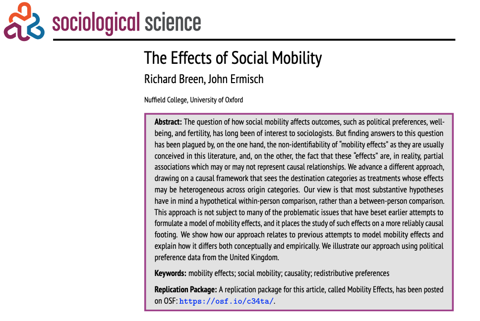

```{r}
#| label: setup
#| include: false
library(knitr)
knitr::opts_chunk$set(echo = F,
                      warning = F,
                      error = F, 
                      message = F) 
```

```{r}
#| label: packages
#| include: false

if (! require("pacman")) install.packages("pacman")

pacman::p_load(tidyverse, 
               here,
               kableExtra)

options(scipen=999)
rm(list = ls())
```


::: columns


::: {.column width="20%"}

</br></br>


:::

::: {.column .column-right width="80%"}


# **Justicia de mercado y merecimiento del bienestar social**

## **Fondecyt Regular No. 1250518**

------------------------------------------------------------------------

**IP: Juan Carlos Castillo^1,^^3^** 

**AI: Andreas Laffert^2,^^3^** 

::: {.blue2 .medium}

**^1^Departamento de Sociología, Universidad de Chile**

**^2^Instituto de Sociología, Pontificia Universidad Católica de Chile**

**^3^Centro de Estudios de Conflicto y Cohesión Social - COES**

:::

Reunión con seminaristas y tesistas

16 Octubre 2025, Santiago

:::
:::


# Contexto y motivación {.xlarge data-background-color="#92220C"}

## Contexto y motivación

::: {.fragment}
<div style="text-align:center;">
  
</div>
:::


## Antecedentes

::: {.box-inv-4 .sp-after .fragment style="font-size: 110%;"}

1) Privatización y mercantilización de  bienes públicos, políticas de bienestar y servicios sociales [@gingrich_making_2011; @streeck_how_2016]

:::

::: {.box-inv-4 .sp-after .fragment style="font-size: 110%;"}

2) En AL y Chile, modificaron la arquitectura de las instituciones del bienestar expandiendo lógica de mercado [@ferre_welfare_2023; @madariaga_three_2020]

:::


::: {.box-inv-4 .sp-after .fragment style="font-size: 110%;"}

3) Este orden económico se refleja en una economía moral específica [@mau_inequality_2015; @svallforsMoralEconomyClass2006a]

:::

::: {.box-inv-5 .sp-after-half .fragment style="font-size: 110%;"}

Preferencias por justicia de mercado [@busemeyer_skills_2014; @castillo_perceptions_2025; @koos_moral_2019; @lindh_public_2015]

:::


## Preferencias por justicia de mercado

::: {.incremental .highlight-last style="font-size: 120%;"}

- Lane [-@lane_market_1986]: justicia de mercado vs. justicia política

- Creencias normativas que legitiman la idea de que el acceso a los servicios sociales esenciales —como la salud, la educación o las pensiones— debe determinarse según criterios basados en el mercado [@lindh_public_2015, p.895]

- Medición: evaluar si las personas consideran justo que el acceso a dichos servicios dependa de los ingresos [@lindh_public_2015; @kluegel_legitimation_1999; @castillo_perceptions_2025]


:::

::: {.box-inv-5 .sp-after .fragment style="font-size: 120%;"}

Preferencias por la comodificación de servicios

:::


## Contexto chileno

::: {.incremental .highlight-last style="font-size: 120%;"}

- Crecimiento con elevada desigualdad [@llorca-jana_historia_2021; @flores_top_2020]
- Rigida movilidad relativa y fuerte clausura cúspide [@lopez-roldan_comparative_2021; @torche_intergenerational_2014]
- Profunda privatización y comodificación de áreas de reproducción social con fuerte dependencia Estatal [@madariaga_three_2020; @boccardo_30_2020]
- Pensiones: sistema de **capitalización individual** administrado por **AFPs**; cubre ~11 millones de cotizantes, pero **27% de la fuerza laboral** queda fuera por **informalidad** [@superintendenciadepensiones_estadisticas_2024]
- Conflictividad social previsional [@somma_no_2021; @nucleodesociologiacontingente_informe_2020] y legitimidad del sistema ("con mi plata no") [@castillo_perceptions_2025; @canalesceron_sujeto_2021; @panes_criticas_2020]
:::


## Preferencias por la comodificación de servicios


::::: columns
::: {.column width="50%" .incremental .highlight-last style="font-size: 110%;"}

### Contextual

- Gasto social [@immergut_it_2020; @busemeyer_skills_2014; @busemeyer_welfare_2020]
- Desigualdad económica [@koos_moral_2019]
- Nivel de privatización de servicios y regulación del mercado [@lindh_public_2015; @koos_moral_2019]

:::

::: {.column width="50%" .incremental .highlight-last style="font-size: 110%;"}

### Individual

- Estatus socioeconómico -ingresos, educación y ocupación- [@lindh_public_2015; @koos_moral_2019; @busemeyer_welfare_2020; @svallfors_political_2007]
- Percepciones sobre la desigualdad y meritocracia [@castillo_perceptions_2025]
- Conservadurismo/liberalismo económico [@lee_fairness_2023]

:::
:::::

## Preferencias por la comodificación de servicios: Chile

::: {.incremental .highlight-last style="font-size: 110%;"}

1. @otero_power_2024 proveen evidencia sobre:
          
   * Personas en posiciones sociales bajas/subordinadas muestran menor apoyo a la justicia de mercado que aquellas en posiciones altas/privilegiadas.

2. @castillo_perceptions_2025 encuentran que:
        
   * La percepción de la desigualdad económica reduce el apoyo a la justicia de mercado.
   * Las percepciones meritocráticas (esfuerzo) aumenta el respaldo a la justicia de mercado.
:::

::: {.fragment style="font-size: 120%;"}
**Sin embargo...**
:::

## Este estudio

</br>

::: {.pull-left .box-inv-5 .sp-after .fragment style="font-size: 120%;"}

El movimiento entre posiciones sociales expone a los individuos a condiciones y experiencias que afectan sus nociones de justicia distributiva [@alesina_intergenerational_2018; @ares_changing_2020; @gugushvili_subjective_2017; @day_movin_2017]

:::

</br></br></br></br>

::: {.pull-right .box-inv-5 .sp-after .fragment style="font-size: 120%;"}

¿Cómo? Movilidad ascendente refuerza ver al mercado como asignador justo, la descendente lo cuestiona. La meritocracia es un canal cognitivo para ese proceso [@mau_inequality_2015; @gugushvili_intergenerational_2016].

:::

#  {data-background-color="#523870"}

:::: {style="font-size: 170%;"}

**_(1) ¿Cómo la movilidad social intergeneracional afecta las preferencias por la comodificación de las pensiones en Chile?_**

**_(2) ¿En qué medida las creencias meritocráticas condicionan esta relación?_**

::::

## Movilidad social

::: {.incremental .highlight-last style="font-size: 120%;"}

- Preferencias redistributivas [@alesina_intergenerational_2018; @ares_changing_2020; @schmidt_experience_2011; @breen_effects_2024]
- Legitimidad de la desigualdad económica [@gugushvili_intergenerational_2016], política social [@gugushvili_subjective_2017] y creencias sobre la desigualdad [@bucca_merit_2016; @day_movin_2017]
- Diversos **mecanismos explicativos** [@helgason_class_2025]: 
          
    * self-interest (ej. intereses materiales, POUM)
    * socialización (ej. aculturación, socialización valores, máximización estatus)
    * **atribuciones** (ej. self-serving bias)

:::

## El mecanismo del *self-serving bias*

::: {.incremental style="font-size:120%;"}

- Las personas ajustan sus **creencias sobre justicia** según cómo explican su posición social [@gugushvili_intergenerational_2016; @miller_selfserving_1975].  
- Las experiencias de movilidad activan **procesos de atribución causal**:  
  - **Interna** → éxito por esfuerzo → el mercado es justo.  
  - **Externa** → fracaso por factores estructurales → el mercado es injusto.  
- **Ascenso:** refuerza la creencia de que el mercado premia el mérito.  
- **Descenso:** puede generar disonancia y cuestionar esa justicia.  

:::


## ¿Cómo?
::: {.incremental .highlight-last style="font-size: 110%;"}
- **No solo cambia intereses materiales**, también cambia **cómo las personas entienden la justicia** [@gugushvili_intergenerational_2016; @helgason_class_2025].
- Al moverse, los individuos **recalibran sus creencias sobre la meritocracia** [@mijs_belief_2022a].
- **Movilidad ascendente →** refuerza la creencia en un mercado justo (asignador legítimo de recompensas).
- **Movilidad descendente →** desafía esa creencia (percepción de arbitrariedad o injusticia).  
- La **meritocracia** filtra estas experiencias [@mau_inequality_2015]:  
  - *Fuerte creencia en mérito →* mantiene la fe en la justicia del mercado (disonancia resuelta internamente).  
  - *Débil creencia en mérito →* percibe el sistema como injusto (disonancia resuelta externamente).  
:::


## Hipótesis

::: {.incremental .highlight-last style="font-size: 120%;"}

- **H1**: La movilidad ascendente refuerza las preferencias por comodificación de pensiones, mientras que la movilidad descendente las reduce.

- **H2a.** El efecto positivo de la movilidad ascendente sobre el apoyo a la mercantilización es más fuerte entre las personas con creencias meritocráticas más sólidas.  
→ *Self-serving bias*: el ascenso confirma que el sistema recompensa el esfuerzo.

- **H2b.** El efecto negativo de la movilidad descendente sobre el apoyo a la mercantilización es más débil entre las personas con creencias meritocráticas más fuertes.  
→ *Resolución de la disonancia*: los meritócratas internalizan la pérdida («mi culpa»), mientras que los no meritócratas la atribuyen al sistema («es injusto»).
:::


# Método {.xlarge data-background-color="#523870"}

## Enfoque: Mobility Effects

::::: columns
::: {.column width="50%"}
::: {.fragment}




:::


:::

::: {.column width="50%" .incremental .highlight-last style="font-size: 100%;"}

- @breen_effects_2024 proponen un método para estimar el efecto (causal) de la movilidad social intergernacional sobre un outcome
- ¿En qué habría cambiado el resultado _Y_ entre las personas de origen _j_ que llegaron al destino _k_ si, hipotéticamente, hubieran llegado al destino _k'_? 


:::
:::::


# Gracias por su atención! 

-   **Github del proyecto:** <https://github.com/jus-mer>

## Referencias

